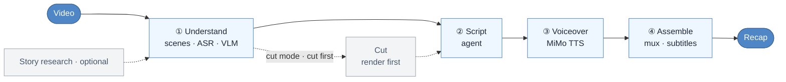

# video-recap-skills

[](LICENSE)


[中文](README.md) · English

**One sentence in Claude Code turns any video into a Chinese-narration recap.** All it needs locally is `ffmpeg` and one Xiaomi MiMo API key — no GPU, no model downloads, runs on macOS / Linux / Windows.

## Demo

<video src="https://github.com/user-attachments/assets/aa96bd1d-ce4b-42bd-a7df-439aeb63dd18" width="640" controls></video>

Beyond the rendered MP4, you can export a **剪映/JianYing draft** to keep editing by hand, with original clips, narration, BGM, and subtitles:


## What it is



## Why use it

- **One key, runs anywhere.** ASR, VLM, and TTS all go through [Xiaomi MiMo](https://platform.xiaomimimo.com); `ffmpeg` is the only local dependency.
- **Research when it matters.** When the title/story context is known or the brief notes the material is thin, put character relationships and plot background in `background_research.json` so the VLM knows who's who.
- **Narration in blocks, original in blocks.** Narration plays in connected blocks, each voiced in one pass; in the gaps, the original audio returns at full volume — roughly 7:3.
- **Cut first, frames aligned.** `--edit-mode cut` renders the cut first, then you narrate against that timeline, so picture and voice stay in sync.
- **Multi-video cut, reusable analysis.** Feed several videos at once, pick ranges by `source_id`, and render one recap; each video's analysis is saved to a filesystem material library you can `grep` and reuse next time.
- **Keep editing in 剪映.** Optionally export a schema-driven draft with editable original clips, narration, BGM, subtitles, and local image overlays. Video/audio/images are bundled under `Resources/local` with a material index, so a clone or moved draft stays usable. ffmpeg remains the canonical render.
- **Optional MiMo adviser, never a gatekeeper.** `--mimo-qc pre-assemble|post-render|both` writes semantic/aesthetic suggestions for the agent/user to `mimo_qc.json`. Missing keys, rate limits, timeouts, and malformed model output are warnings only—never blockers or automatic edits.

## Installation

**① Install the plugin** — add this repo as a marketplace and install, inside Claude Code:

```text
/plugin marketplace add worldwonderer/video-recap-skills
/plugin install video-recap-skills@video-recap
```

> Or skip the commands and tell Claude Code:
>
> ```text
> Install this plugin: https://github.com/worldwonderer/video-recap-skills
> ```

**② Install ffmpeg** (no `pip install`: pure standard library + `ffmpeg` on `PATH`, Python 3.10+):

```bash
brew install ffmpeg                        # macOS
sudo apt install ffmpeg                     # Debian/Ubuntu
choco install ffmpeg                        # Windows (or scoop / winget install ffmpeg)
```

Subtitles are burned into the picture by default, which needs an ffmpeg built with **libass (the `subtitles` filter)** — the packages above include it in almost all cases. If yours lacks libass, the run fails fast at the start with a clear message (or pass `--no-burn-subtitles` to keep the MP4 unmasked and subtitles as a sidecar `.srt`). Run `python3 skills/video-recap/scripts/recap.py --doctor` to self-check.

**③ Set your MiMo API key** (one key powers ASR / VLM / TTS — register at [platform.xiaomimimo.com](https://platform.xiaomimimo.com), then keep it in an env var, never in the repo):

```bash
export MIMO_API_KEY=your-mimo-key
# tp-* Token-Plan keys auto-connect to a cluster: cn | sgp | ams
export MIMO_TOKEN_PLAN_CLUSTER=cn
```

Pay-as-you-go `sk-*` keys default to `https://api.xiaomimimo.com/v1`. Everything else has a default; to change the model, voice, loudness, or subtitles, or set a key/URL per capability, see the
[config playbook](skills/video-recap/references/config-playbook.md).

## Use it in other agent harnesses (opencode / Codex / OpenClaw)

The engine is plain Python + ffmpeg + one MiMo key — harness-agnostic — so it also runs under other agent CLIs. Get the shared prerequisites first: **ffmpeg** on `PATH`, **`MIMO_API_KEY`** set, **Python 3.10+** (as above).

- **Codex CLI** (verified) — it reads this repo's `.claude-plugin/marketplace.json` directly:

  ```bash
  codex plugin marketplace add worldwonderer/video-recap-skills
  codex plugin add video-recap-skills@video-recap
  ```

  (The `owner/repo` form works once the repo is published; locally use `codex plugin marketplace add ./video-recap-skills`.)

- **OpenClaw** (verified) — it imports the Claude plugin bundle directly. After cloning, point the argument at the cloned directory:

  ```bash
  openclaw plugins install ./video-recap-skills
  ```

  All 6 skills become native, auto-triggering skills (`openclaw skills list`).

- **opencode** (per its docs; not run-verified here) — opencode auto-discovers skills under `.claude/skills` / `.agents/skills` / `.opencode/skills`. After cloning, expose `skills/` under one of them:

  ```bash
  mkdir -p .claude && ln -s ../skills .claude/skills   # macOS / Linux
  # Windows: create .claude\skills first, then copy skills\* into it
  ```

> Harnesses don't always run commands from the skill's directory; the "Running the scripts" note at the top of each `SKILL.md` shows how to invoke them by absolute path (the scripts self-locate via `__file__`).
> **Don't double-register**: registering the same skills through more than one discovery path (the repo's `skills/`, a copy under `~/.agents/skills`, a harness install cache) can cause name clashes or double auto-triggering — enable just one.

## Usage

Point it at a video and give it whatever story context you have:

```text
Make a recap of /path/to/video.mp4. It's 庆余年 episode 1; the lead is 范闲.
```

It analyzes the video, writes the narration against that context, and produces `recap_<name>.mp4` with subtitles.

```text
Turn /path/to/long.mp4 into a ~10-minute cut-down recap and burn the subtitles in.
```

Behind the scenes the orchestrator chains the stages, pausing so the agent can write the narration (cut mode pauses twice: first write `clip_plan.json` to pick the footage, then — once the cut is rendered — write `narration.json` against that output). Before the first run, check your setup:

Multi-video recap is an MVP for cut mode only:

```bash
python3 skills/video-recap/scripts/recap.py ep1.mp4 ep2.mp4 --edit-mode cut --target-duration 10m --work-dir work_dir_multi_story
```

Each source is analyzed under `work_dir_multi_story/sources/<source_id>/`; the project-level `multi_source_manifest.json` records `source_id → source_path`, and each `clip_plan.json` clip must include `source_id`.

The optional material library is filesystem-only and grep-friendly:

```bash
python3 skills/video-recap/scripts/recap.py ep1.mp4 --edit-mode cut \
  --material-library-dir .video-materials --save-materials

grep -R "hero" .video-materials

python3 skills/video-recap/scripts/recap.py ep1.mp4 ep2.mp4 --edit-mode cut \
  --material-library-dir .video-materials --use-materials
```

It stores small JSON/MD artifacts plus an append-only `materials_index.jsonl`; it does not copy raw media, create a DB, or use embeddings/semantic search.

```bash
python3 skills/video-recap/scripts/recap.py --doctor
```

Explicitly opt into advisory quality review (off by default):

```bash
python3 skills/video-recap/scripts/recap.py /path/to/video.mp4 --work-dir work_dir_video \
  --mimo-qc both
```

Each selected stage makes at most one request and uses a content cache;
`--mimo-qc-refresh` bypasses it. Post-render review temporarily samples at most
six JPEGs, each at most 768px on its longest side, and never persists base64.
`mimo_qc.json` is always advisory and cannot become a blocker.

## Enhanced rendering: source-pinned subtitles and cloned narration voice

These enhancements are adapted from
[ops120/video-recap-skills-plus](https://github.com/ops120/video-recap-skills-plus). Thanks to
[@ops120](https://github.com/ops120) for publishing and maintaining the downstream implementation.

Pin recap subtitles to the source video's burned-in subtitle band (this explicitly enables
masking for that measured band; the enhanced default is **60% opacity during narration only**,
leaving original-audio gaps clean):

```bash
python3 tools/measure_subtitle.py /path/to/video.mp4 --accept-detected
python3 skills/video-recap/scripts/recap.py /path/to/video.mp4 \
  --subtitle-y-top 610 --subtitle-y-bot 660
```

The measurement tool still uses only stdlib + ffmpeg. For each source it writes grid/red-band
previews under `.subtitle_measure/<video-source-id>/preview/` plus a source-identified
`subtitle_positions.json`; omit `--accept-detected` to inspect and confirm the coordinates
interactively. Coordinates use a half-open `[top, bot)` interval on ffmpeg's auto-rotated display canvas and currently require
square-pixel (SAR `1:1`) video plus bottom-aligned subtitles (`SUBTITLE_ALIGNMENT=1|2|3`). Tune with
`SUBTITLE_MASK_OPACITY` (`0..1`) and
`SOURCE_SUBTITLE_MASK_TIMING=all|narration`. Windows containing replacement original-dialogue
subtitles are masked opaquely so they cannot stack over the source hard subtitles.

Clone an arbitrary reference voice for recap narration (distinct from full-track translation in
`--edit-mode dub`):

```bash
python3 skills/video-recap/scripts/recap.py /path/to/video.mp4 --voice-ref /path/to/voice-ref.wav
```

The reference is normalized to 24 kHz mono once, lazily when fresh TTS is needed; a fully cached
rerun does not transcode it. Its content hash is part of the TTS cache fingerprint, so replacing
the file cannot silently reuse old speech. **Use voice cloning only with the voice owner's
authorization. The reference audio is sent to the MiMo service for synthesis.**

## English video → Chinese dub · original voice

Translate an English video into Chinese and voice it in the **original speaker's timbre** (cloned, not a fixed voice), leaving the picture unchanged. Unlike "recap" (Chinese commentary over ducked audio), dubbing **replaces** the original speech with a faithful Chinese translation. Trigger it in natural language, like recap:

```text
Dub /path/to/english.mp4 into Chinese, keeping the original speaker's voice.
```

It runs English ASR, splits into complete sentences, pulls one reference clip, then pauses for the agent to write the per-sentence Chinese translation; rerunning clones the original voice line by line (`mimo-v2.5-tts-voiceclone`) and time-fits each to its **source-sentence** window (anchored at the source start; sped up only if it would overrun the next line — never globally, so the voice never finishes ahead of the picture), full-track replaces the audio, and writes `dub_<name>.mp4`. v1: single speaker, full-track replace (no background-music separation).

## Architecture

| Skill | Does | In → Out (the `work_dir` contract) |
|---|---|---|
| **video-understanding** | scene detect · frame extract · ASR (`mimo-v2.5-asr`) · VLM (`mimo-v2.5`) · fuse timeline · build brief (`--consolidate` index on by default) | `video` → `scenes / asr_result / vlm_analysis / silence_periods / timeline_fusion / agent_narration_brief.md` |
| **video-script** | writing rules (SKILL.md) + review (LLM-as-judge) + lint/validate | `brief + index` → `narration.json` |
| **video-cut** | clip plan → render the cut (cut-first/narrate-second; narration is written on the output timeline, no remap) | `clip_plan.json + video` → `edited_source.mp4` |
| **video-voiceover** | synthesize narration audio (MiMo TTS, `mimo-v2.5-tts`) | `narration.json` → `tts_segments/ + tts_meta.json` |
| **video-assemble** | mux · duck original audio · render subtitles · multi-track timeline (optional 剪映 export) | `video + tts_meta` → `recap_<name>.mp4 + subtitles.srt/.ass + timeline.json` |
| **video-recap** | orchestrator + `--doctor` | `video` → `recap_<name>.mp4` |

## Output

- `recap_<name>.mp4`: the final recap; a stable alias overwritten in place on every run. `subtitles.srt` (plus `subtitles.ass`; subtitle burn-in is on by default, `--no-burn-subtitles` to disable)
- `work_dir/narration.json`: the narration script (`narration_lint.json` timing diagnostics, `narration_review.md` review notes)
- `work_dir/agent_narration_brief.md`: timing and scene brief for the agent
- `work_dir/vlm_analysis.json` · `asr_result.json` · `silence_periods.json` · `timeline_fusion.json`: understanding artifacts
- `work_dir/clip_plan.json` · `edited_source.mp4` · `recap_phase.json`: cut-mode artifacts (narration is written on the output timeline; `recap_phase.json` records cut/narrate progress for deterministic resume)
- `work_dir/multi_source_manifest.json` · `work_dir/sources/<source_id>/`: multi-video cut source manifest and per-source analysis artifacts
- `<material-library-dir>/materials/<material_id>/material.json|material.md` · `materials_index.jsonl`: optional grep-friendly material library for reusing analyzed sources
- `work_dir/timeline.json` · `work_dir/assembly_manifest.json` · `tts_segments/` · `tts_meta.json`: multi-track timeline, slim render record, and TTS audio
- `work_dir/mimo_qc.json`: optional aggregated pre-assemble/post-render MiMo advice; never a gate

## Bring your own original-dialogue subtitles (optional, more accurate)

During the original-audio gaps between narration blocks, the original dialogue is burned as a subtitle (wrapped in `「」` to set it apart from narration). By default that text is agent-proofread with an ASR fallback — but ASR timing is coarse and can drift from the audio. For accurate timing, drop a subtitle file into `work_dir`; it becomes the **preferred source**:

- `work_dir/user_subtitles.json`: `[{"start": s, "end": s, "text": "line"}]` on the **output** timeline, used as-is; or wrap it as `{"timeline": "source", "lines": [...]}` to give **source**-timeline subs that are auto-mapped onto the cut via the clip plan.
- `work_dir/user_subtitles.srt` / `.ass`: parsed as **source**-timeline by default and mapped onto the cut.

Priority: **your file › the agent-proofread `original_subtitles.json` › ASR fallback**. When the source is accurate, each line is clipped precisely into its gap instead of being placed by a coarse midpoint estimate.

## References

- Per-skill contracts: each `skills/<skill>/SKILL.md` (the writing rules are in video-script's SKILL.md)
- [Data schema](skills/video-recap/references/data-schema.md) · [Config playbook](skills/video-recap/references/config-playbook.md) · [Multi-track timeline / 剪映 export](skills/video-recap/references/timeline-and-jianying.md)
- [Background research guide](skills/video-understanding/references/research-guide.md) · [VLM prompt templates](skills/video-understanding/references/prompt-templates.md)

## Acknowledgements

- [linux.do](https://linux.do)
- The 剪映 draft protocol references [pyJianYingDraft](https://github.com/GuanYixuan/pyJianYingDraft), [capcut-mate](https://github.com/Hommy-master/capcut-mate), and [duo-video](https://github.com/duoec/duo-video).

## License

MIT, see [LICENSE](LICENSE).
