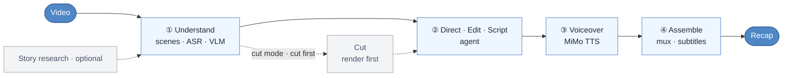

# video-recap-skills

[](LICENSE)


[中文](README.md) · English

**In Claude Code, Codex CLI, OpenCode, or OpenClaw, one natural-language request turns a video into a Chinese-narration recap.** It needs only Python, `ffmpeg`, and one Xiaomi MiMo API key locally: no GPU, no model downloads, and it runs on macOS / Linux / Windows.

## Demo

<video src="https://github.com/user-attachments/assets/aa96bd1d-ce4b-42bd-a7df-439aeb63dd18" width="640" controls></video>

Beyond the rendered MP4, you can export a **剪映/JianYing draft** to keep editing by hand, with original clips, narration, BGM, and subtitles:


## What it is



## Why use it

- **One key, runs anywhere.** ASR, VLM, and TTS all go through [Xiaomi MiMo](https://platform.xiaomimimo.com); the local runtime uses only Python's standard library and `ffmpeg`, with no `pip install`.
- **Research when it matters.** When the title/story context is known or the brief notes the material is thin, put character relationships and plot background in `background_research.json` so the VLM knows who's who.
- **Make the editorial decision before allocating sound.** The agent first compares edit hypotheses and locks the POV, story spine, exact picture moments, and original-audio anchors. Narration is voiced as a block only when it has a defined job; strong dialogue, action sound, or silence may own an entire beat. A 7:3 split is only a rough fallback, never a quota.
- **Cut first, frames aligned.** Cut mode renders the shortened video first, then writes narration against that output timeline, so picture and voice stay in sync.
- **Multi-video cut, reusable analysis.** Feed several videos at once, pick ranges by `source_id`, and render one recap; each video's analysis is saved to a filesystem material library you can `grep` and reuse next time.
- **Keep editing in 剪映.** Optionally export a schema-driven draft with editable original clips, narration, BGM, subtitles, and local image overlays. Video/audio/images are bundled under `Resources/local` with a material index, so a clone or moved draft stays usable. ffmpeg remains the canonical render.
- **Optional MiMo adviser, never a gatekeeper.** On request, MiMo can review the project before assembly or after rendering. Missing keys, rate limits, timeouts, and malformed model output are warnings only, never blockers or automatic edits.

## Installation

### 1. Shared prerequisites

- Python 3.10+
- `ffmpeg` on `PATH`; subtitle burn-in is enabled by default and requires libass / the `subtitles` filter
- One [Xiaomi MiMo](https://platform.xiaomimimo.com) API key for ASR, VLM, and TTS

```bash
brew install ffmpeg                         # macOS
sudo apt install ffmpeg                    # Debian / Ubuntu
choco install ffmpeg                       # Windows; scoop or winget also work

export MIMO_API_KEY=your-mimo-key          # macOS / Linux
export MIMO_TOKEN_PLAN_CLUSTER=cn          # optional for tp-* keys: cn | sgp | ams
```

In Windows PowerShell, use `$env:MIMO_API_KEY="your-mimo-key"`. Pay-as-you-go `sk-*` keys default to `https://api.xiaomimimo.com/v1`. See the [config playbook](skills/video-recap/references/config-playbook.md) for model, voice, loudness, subtitle, and per-capability settings.

### 2. Choose an agent host

#### Claude Code

Run inside Claude Code:

```text
/plugin marketplace add worldwonderer/video-recap-skills
/plugin install video-recap-skills@video-recap
```

Or simply ask:

```text
Install this plugin: https://github.com/worldwonderer/video-recap-skills
```

#### Codex CLI

```bash
codex plugin marketplace add worldwonderer/video-recap-skills
codex plugin add video-recap-skills@video-recap
```

For a local checkout, replace the marketplace source in the first command with its directory. This flow was smoke-tested with an isolated `CODEX_HOME` on Codex CLI `0.144.1`.

#### OpenCode

The official [OpenCode Agent Skills documentation](https://opencode.ai/docs/skills/) defines project skills under `.opencode/skills/<name>/SKILL.md`. Clone the repository and start OpenCode from that directory:

```bash
git clone https://github.com/worldwonderer/video-recap-skills.git
cd video-recap-skills
mkdir -p .opencode
ln -s ../skills .opencode/skills             # macOS / Linux
opencode debug skill
```

On Windows, copy `skills\*` into `.opencode\skills\`. This PR was run-verified on OpenCode `1.14.32`: `opencode debug skill` discovered all 6 skills. Use `video-recap` for normal end-to-end production, `video-script` for planning or writing only, and the other four skills as tool stages.

#### OpenClaw

After cloning, import the Claude plugin bundle and check the discovered skills:

```bash
openclaw plugins install ./video-recap-skills
openclaw skills list
```

Do not register the same checkout through multiple discovery paths; duplicate registration can cause name collisions or repeated triggers.

After installation, ask the agent to check the environment:

```text
Check the video-recap environment and tell me whether Python, ffmpeg/libass, and MiMo are ready.
```

## Usage

Give the agent the video paths, desired result, and any useful story context. Users do not need to run the repository's Python scripts directly.

**Full-video recap:**

```text
Make a Chinese-narration recap of /path/to/video.mp4. It is episode 1 of 庆余年, the lead is 范闲, and subtitles should be burned in.
```

**Cut a long video into a shorter recap:**

```text
Turn /path/to/long.mp4 into a roughly ten-minute recap while preserving key original dialogue and character reactions.
```

**Build one story from multiple videos:**

```text
Use /path/to/ep1.mp4 and /path/to/ep2.mp4 to make one ten-minute recap with a shared story spine, not two separate summaries.
```

The agent handles understanding, story and audiovisual planning, editing, narration, voiceover, and assembly. In cut mode it first chooses footage, renders the shortened video, and only then writes narration on the output timeline; the agent also handles the internal pauses and resume steps.

## Common advanced requests

**Reuse previously analyzed material:**

```text
Analyze /path/to/ep1.mp4 and save reusable understanding artifacts under /path/to/.video-materials. Prefer that material library in later projects.
```

The library contains JSON, Markdown, and an index only. It does not copy raw media, create a database, or use embeddings; the agent searches it directly on the filesystem.

**Add advisory quality review and export a JianYing draft:**

```text
Make a recap of /path/to/video.mp4, run MiMo quality review before assembly and after rendering, and export an editable JianYing draft.
```

MiMo review is always advisory: at most one request per selected stage, fail-open, and never an automatic edit or render blocker.

**Align new subtitles with the source's burned-in subtitle band:**

```text
Detect the source subtitle band in /path/to/video.mp4 and let me confirm the preview before rendering recap subtitles in the same region.
```

The measurement preview is stored under `.subtitle_measure/`. It currently requires square-pixel video and bottom-aligned source subtitles. This capability is adapted from [ops120/video-recap-skills-plus](https://github.com/ops120/video-recap-skills-plus).

**Clone an authorized reference voice:**

```text
Use the voice from /path/to/voice-ref.wav for the recap of /path/to/video.mp4. I have the voice owner's authorization.
```

The reference audio is sent to MiMo for synthesis and its content fingerprint participates in cache validation. Use voice cloning only with the voice owner's authorization.

**Dub an English video into Chinese while preserving the voice:**

```text
Dub /path/to/english.mp4 into Chinese, keeping the original speaker's voice.
```

This replaces the original speech instead of overlaying commentary. The current version supports one speaker and full-track replacement without background-music separation.

## Architecture

| Skill | Does | In → Out (the `work_dir` contract) |
|---|---|---|
| **video-understanding** | scene detect · frame extract · ASR (`mimo-v2.5-asr`) · VLM (`mimo-v2.5`) · fuse timeline · build brief | `video` → `scenes / asr_result / vlm_analysis / silence_periods / timeline_fusion / agent_narration_brief.md` |
| **video-script** | directing/story/picture/audio plan + narration + advisory review + lint/validate | `brief + index` → `recap_story_plan.json + visual_audio_board.json + [clip_plan.json] + narration.json` |
| **video-cut** | clip plan → render the cut (cut-first/narrate-second; narration is written on the output timeline, no remap) | `clip_plan.json + video` → `edited_source.mp4` |
| **video-voiceover** | synthesize narration audio (MiMo TTS, `mimo-v2.5-tts`) | `narration.json` → `tts_segments/ + tts_meta.json` |
| **video-assemble** | mux · duck original audio · render subtitles · multi-track timeline (optional 剪映 export) | `video + tts_meta` → `recap_<name>.mp4 + subtitles.srt/.ass + timeline.json` |
| **video-recap** | orchestration and environment diagnostics | `video` → `recap_<name>.mp4` |

## Output

- `recap_<name>.mp4`: the final recap, written to a stable name; subtitles are burned in by default and also written as `subtitles.srt` and `subtitles.ass`
- `work_dir/narration.json`: the narration script (`narration_lint.json` timing diagnostics, `narration_review.md` review notes)
- `work_dir/recap_story_plan.json` · `visual_audio_board.json`: agent-authored story, picture, and audio decisions for resume/advisory review; not a render gate
- `work_dir/agent_narration_brief.md`: timing and scene brief for the agent
- `work_dir/vlm_analysis.json` · `asr_result.json` · `silence_periods.json` · `timeline_fusion.json`: understanding artifacts
- `work_dir/clip_plan.json` · `edited_source.mp4` · `recap_phase.json`: cut-mode artifacts (narration is written on the output timeline; `recap_phase.json` records cut/narrate progress for deterministic resume)
- `work_dir/multi_source_manifest.json` · `work_dir/sources/<source_id>/`: multi-video cut source manifest and per-source analysis artifacts
- `<material-library-dir>/materials/<material_id>/material.json|material.md` · `materials_index.jsonl`: optional grep-friendly material library for reusing analyzed sources
- `work_dir/timeline.json` · `work_dir/assembly_manifest.json` · `tts_segments/` · `tts_meta.json`: multi-track timeline, slim render record, and TTS audio
- `work_dir/mimo_qc.json`: optional aggregated pre-assemble/post-render MiMo advice; never a gate

## Bring your own original-dialogue subtitles (optional, more accurate)

During the original-audio gaps between narration blocks, the original dialogue is burned as a subtitle (wrapped in `「」` to set it apart from narration). By default that text is agent-proofread with an ASR fallback — but ASR timing is coarse and can drift from the audio. For accurate timing, drop a subtitle file into `work_dir`; it becomes the **preferred source**:

- `work_dir/user_subtitles.json`: `[{"start": s, "end": s, "text": "line"}]` on the **output** timeline, used as-is; or wrap it as `{"timeline": "source", "lines": [...]}` to give **source**-timeline subs that are auto-mapped onto the cut via the clip plan.
- `work_dir/user_subtitles.srt` / `.ass`: parsed as **source**-timeline by default and mapped onto the cut.

Priority: **your file › the agent-proofread `original_subtitles.json` › ASR fallback**. When the source is accurate, each line is clipped precisely into its gap instead of being placed by a coarse midpoint estimate.

## References

- Per-skill contracts: each `skills/<skill>/SKILL.md` (the writing rules are in video-script's SKILL.md)
- [Data schema](skills/video-recap/references/data-schema.md) · [Config playbook](skills/video-recap/references/config-playbook.md) · [Multi-track timeline / 剪映 export](skills/video-recap/references/timeline-and-jianying.md)
- [Background research guide](skills/video-recap/references/research-guide.md) · [VLM prompt templates](skills/video-understanding/references/prompt-templates.md)

## Acknowledgements

- [linux.do](https://linux.do)
- The 剪映 draft protocol references [pyJianYingDraft](https://github.com/GuanYixuan/pyJianYingDraft), [capcut-mate](https://github.com/Hommy-master/capcut-mate), and [duo-video](https://github.com/duoec/duo-video).

## License

MIT, see [LICENSE](LICENSE).
