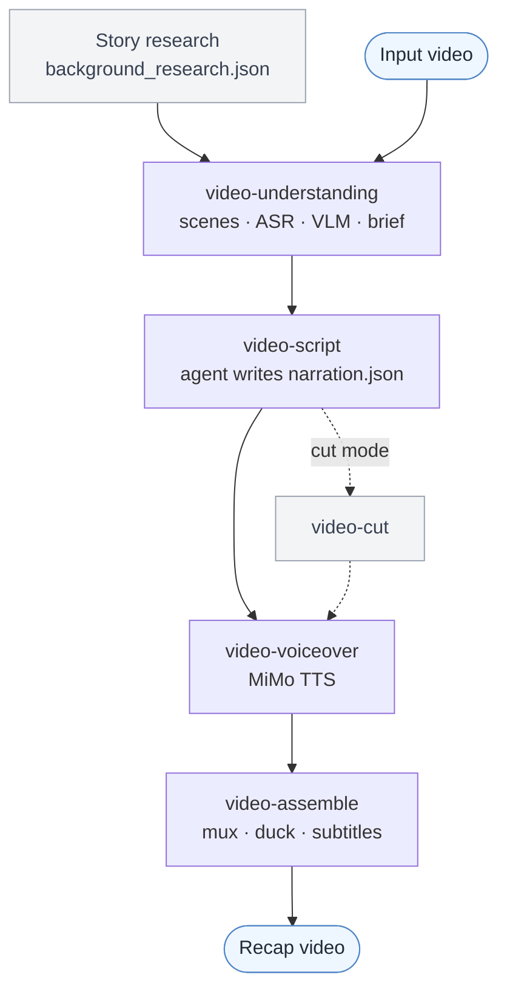

# video-recap-skills

[](LICENSE)


[中文](README.md) · English

A Claude Code plugin that turns a video into a Chinese-narration recap. One pipeline runs background research, ASR + VLM scene understanding, agent-written narration, TTS voiceover, subtitles, and audio mixing, built from a set of small, independent skills. All it needs to run is ffmpeg and one Xiaomi MiMo API key.

## Demo

https://github.com/user-attachments/assets/92698ec6-0d23-4f9f-8825-c3684ef57aff

## What is it?

`video-recap-skills` lets an agent turn an existing video into a short narrated recap. It is five independent skills plus a thin orchestrator: each skill owns one stage, they share no code, and they pass results to each other only as JSON/MP4 files in a shared `work_dir`. The agent writes the narration; the scripts do the deterministic media work (cutting, voicing, mixing).

The whole pipeline runs on ffmpeg and a single [Xiaomi MiMo](https://platform.xiaomimimo.com) API key: speech-to-text, vision understanding, and text-to-speech all go through MiMo. There is no GPU to manage, nothing to download, and no extra service to run, on macOS, Linux, or Windows.



## Architecture

`video-recap` is the one you drive. It calls each stage skill as a subprocess and stops to let the agent write the narration. The four pure-tool stages are hidden (`user-invocable: false`), so only `video-recap` and `video-script` are exposed.

| Skill | Does | In → Out (the `work_dir` contract) |
|---|---|---|
| **video-understanding** | scene detect · frame extract · ASR (`mimo-v2.5-asr`) · VLM (`mimo-v2.5`) · fuse timeline · build brief (+ optional `--consolidate` index) | `video` → `scenes / asr_result / vlm_analysis / silence_periods / timeline_fusion / agent_narration_brief.md` |
| **video-script** | writing rules (SKILL.md) + review (LLM-as-judge) + lint/validate | `brief + index` → `narration.json` |
| **video-cut** | clip plan → cut source + remap narration (cut mode) | `clip_plan.json + video` → `edited_source.mp4 + narration_mapped.json` |
| **video-voiceover** | synthesize narration audio (MiMo TTS, `mimo-v2.5-tts`) | `narration.json` → `tts_segments/ + tts_meta.json` |
| **video-assemble** | mux · duck original audio · render subtitles · multi-track timeline (optional 剪映 export) | `video + tts_meta` → `recap_<name>.mp4 + subtitles.srt/.ass + timeline.json` |
| **video-recap** | orchestrator + `--doctor` | `video` → `recap_<name>.mp4` |

Each skill ships its own `lib.py` with its config and helpers. There is no shared code file; the JSON artifacts are the only interface. See each skill's `SKILL.md` for its full options.

## Why use it?

**One key, runs anywhere.** ASR, VLM, and TTS all hit MiMo's OpenAI-compatible API, so the only thing you install locally is ffmpeg. No GPU, no model files.

**Research before analysis.** Put the plot, characters, and relationships into `background_research.json` first; the VLM reads scenes with that knowledge and names people, instead of labelling everyone "黑衣男子".

**It reads the screen and hears the dialogue.** `mimo-v2.5-asr` transcribes speech; `mimo-v2.5` describes each scene and its frame-level actions, lined up with the scene cuts.

**Optional index pass.** `--consolidate` rolls the per-scene VLM into one global character / relationship / plot index; `--consolidate-asr` cleans the transcript without touching timestamps.

**A review pass before TTS.** `review.py` flags problems in the draft (hallucination, weak hook, no throughline, density) as advisory, logged notes. The one that can actually block is `validate.py`.

**The original audio survives.** Narration is mixed in over a ducked original track instead of replacing the dialogue and ambience.

**Multi-track timeline, optional 剪映 export.** Assembly also emits a backend-neutral `timeline.json` (video / original / narration / BGM / subtitle tracks with ducking automation). Add `--export-jianying` to turn it into a 剪映/JianYing draft — original clips, separate audio tracks, and volume keyframes — to keep editing by hand. This is fully optional: the core render only needs `ffmpeg` and never depends on 剪映.

**Re-runs are cheap.** Edit `narration.json` and only the voiceover and assembly re-run; the analysis is reused.

**Cut-style recaps.** `--edit-mode cut` picks source ranges in `clip_plan.json` to turn a long video into a shorter narrated edit.

## Installation

### 1. Install the plugin

Ask Claude Code:

```text
Install this plugin: https://github.com/worldwonderer/video-recap-skills
```

### 2. Install ffmpeg

```bash
# macOS
brew install ffmpeg
# Debian/Ubuntu
sudo apt install ffmpeg
# Windows (choose one)
choco install ffmpeg   # or: scoop install ffmpeg   |   winget install ffmpeg
```

Python 3.10+ is the only other requirement. The scripts use the standard library plus ffmpeg on `PATH`, so the pipeline itself needs no `pip install`.

### 3. Set your MiMo API key

One key powers ASR, VLM, and TTS. Keep it in an environment variable, never in the repo.

```bash
export MIMO_API_KEY=your-mimo-key
```

Pay-as-you-go `sk-*` keys default to `https://api.xiaomimimo.com/v1`. Token-Plan `tp-*` keys connect to the Token-Plan cluster (default `cn`):

```bash
export MIMO_TOKEN_PLAN_CLUSTER=cn   # cn | sgp | ams
# or pin the base URL: export MIMO_API_URL=https://token-plan-cn.xiaomimimo.com/v1
```

Everything else has a default. To change a model, the ASR window, the voice, loudness, subtitles, and so on, see
[`skills/video-recap/references/config-playbook.md`](skills/video-recap/references/config-playbook.md).
If you want a separate key or URL per capability, use `MIMO_VIDEO_API_KEY` / `MIMO_TTS_API_KEY` / `MIMO_ASR_API_KEY` (and the matching `*_API_URL`); anything unset falls back to `MIMO_API_KEY` / `MIMO_API_URL`.

## Usage

It is a Claude Code skill, so you drive it in plain language. After installing the plugin, point it at a video and give it whatever story context you have:

```text
Make a recap of /path/to/video.mp4. It's 庆余年 episode 1; the lead is 范闲.
```

Claude Code analyzes the video, writes the narration against that context, and produces `recap_<name>.mp4` with subtitles. Ask for variations the same way:

```text
Turn /path/to/long.mp4 into a ~10-minute cut-down recap and burn the subtitles in.
```

Behind the scenes the orchestrator chains the stages (understand → script → (cut) → voiceover → assemble), pausing so the agent can write `narration.json`; cut mode and burned-in subtitles are just flags it sets. To follow the steps or run one stage yourself, read each `skills/<skill>/SKILL.md`.

Before the first run, check your setup:

```bash
python3 skills/video-recap/scripts/recap.py --doctor
```

## Output

- `recap_<video>.mp4`: the final recap. `subtitles.srt` (plus `subtitles.ass` with `--burn-subtitles`)
- `work_dir/agent_narration_brief.md`: timing and scene brief for the agent
- `work_dir/narration.json`: the narration script. `work_dir/narration_lint.json`: timing diagnostics
- `work_dir/narration_review.md`: review notes (optional, advisory)
- `work_dir/vlm_analysis.json`, `asr_result.json`, `silence_periods.json`, `timeline_fusion.json`: understanding artifacts
- `work_dir/understanding_index.json` / `asr_clean.json`: `--consolidate` outputs
- `work_dir/clip_plan.json`, `edited_source.mp4`, `narration_mapped.json`: cut-mode artifacts
- `work_dir/mimo_video_overview.json`: MiMo scene-chunk understanding (`--mimo-video-overview`, optional)
- `work_dir/tts_segments/`, `tts_meta.json`: TTS audio and placement

## References

- Per-skill contracts: each `skills/<skill>/SKILL.md` (the writing rules are in video-script's SKILL.md)
- [Data schema](skills/video-recap/references/data-schema.md) · [Config playbook](skills/video-recap/references/config-playbook.md) · [Multi-track timeline / 剪映 export](skills/video-recap/references/timeline-and-jianying.md)
- [Background research guide](skills/video-understanding/references/research-guide.md) · [VLM prompt templates](skills/video-understanding/references/prompt-templates.md)

## Acknowledgements

- [linux.do](https://linux.do)
- The optional 剪映 draft export follows the draft structure of [pyJianYingDraft](https://github.com/GuanYixuan/pyJianYingDraft) (© GuanYixuan, Apache-2.0) and [capcut-mate](https://github.com/Hommy-master/capcut-mate) (© Hommy, Apache-2.0). No third-party code is vendored; the draft JSON is generated by this project itself.

## License

MIT, see [LICENSE](LICENSE).
