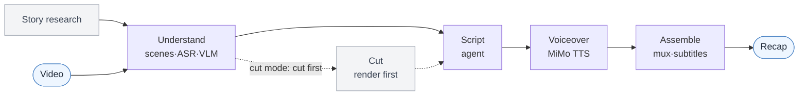

# video-recap-skills

[](LICENSE)


[中文](README.md) · English

**Turn any video into a Chinese-narration recap — from one sentence inside Claude Code.** All it needs locally is `ffmpeg` and one Xiaomi MiMo API key. No GPU, no model downloads.

## Demo

https://github.com/user-attachments/assets/92698ec6-0d23-4f9f-8825-c3684ef57aff

Beyond the rendered MP4, you can export a **剪映/JianYing draft** to keep editing by hand — original clips, narration, BGM, and subtitles each on their own track, with the ducking as editable volume keyframes:


## What is it?

A Claude Code plugin: five small, independent skills plus a thin orchestrator. Each owns one stage and they pass results only as JSON/MP4 files in a shared `work_dir`. **The scripts do the deterministic media work (cutting, voicing, mixing); the agent writes the narration.**



## Why use it?

- **One key, runs anywhere.** ASR, VLM, and TTS all go through [Xiaomi MiMo](https://platform.xiaomimimo.com); the only local dependency is `ffmpeg` — no GPU, no model files, no extra service, on macOS / Linux / Windows.
- **Research before analysis.** Put the plot and characters into `background_research.json` first, and the VLM names people on screen instead of labelling everyone "黑衣男子".
- **Original audio survives, continuous bed.** Narration is mixed over the original ducked into one continuous low bed; the short gaps between sentences no longer let the original pop back up (tunable via `duck_bridge_seconds`) — only the lead-in, lead-out, and pauses longer than that threshold return to full volume.
- **Cut and review.** `--edit-mode cut` is cut-first/narrate-second: it renders the cut from `clip_plan.json`, then you narrate against that real output timeline, so narration and picture stay in sync by construction. An LLM review pass flags hallucinations, weak hooks, and a missing throughline before TTS.
- **Keep editing in 剪映.** Optionally export a multi-track 剪映 draft; the core render only needs `ffmpeg` and never depends on 剪映.

## Installation

**① Install the plugin** — ask Claude Code:

```text
Install this plugin: https://github.com/worldwonderer/video-recap-skills
```

**② Install ffmpeg** (the pipeline needs no `pip install` — just the standard library and `ffmpeg` on `PATH`, Python 3.10+):

```bash
brew install ffmpeg                        # macOS
sudo apt install ffmpeg                     # Debian/Ubuntu
choco install ffmpeg                        # Windows (or scoop / winget install ffmpeg)
```

**③ Set your MiMo API key** (one key powers ASR / VLM / TTS — keep it in an env var, never in the repo):

```bash
export MIMO_API_KEY=your-mimo-key
# tp-* Token-Plan keys auto-connect to a cluster: cn | sgp | ams
export MIMO_TOKEN_PLAN_CLUSTER=cn
```

Pay-as-you-go `sk-*` keys default to `https://api.xiaomimimo.com/v1`. Everything else has a default; to change a model, the voice, loudness, subtitles, or set a key/URL per capability, see the
[config playbook](skills/video-recap/references/config-playbook.md).

## Usage

Point it at a video and give it whatever story context you have:

```text
Make a recap of /path/to/video.mp4. It's 庆余年 episode 1; the lead is 范闲.
```

It analyzes the video, writes the narration against that context, and produces `recap_<name>.mp4` with subtitles. Ask for variations the same way:

```text
Turn /path/to/long.mp4 into a ~10-minute cut-down recap and burn the subtitles in.
```

Behind the scenes the orchestrator chains the stages, pausing so the agent can write the narration (cut mode pauses twice: first write `clip_plan.json` to pick the footage, then — once the cut is rendered — write `narration.json` against that output). Before the first run, check your setup:

```bash
python3 skills/video-recap/scripts/recap.py --doctor
```

## Architecture

`video-recap` is the one you drive: it calls each stage skill as a subprocess and stops to let the agent write the narration. The four pure-tool stages are hidden (`user-invocable: false`), so only `video-recap` and `video-script` are exposed.

| Skill | Does | In → Out (the `work_dir` contract) |
|---|---|---|
| **video-understanding** | scene detect · frame extract · ASR (`mimo-v2.5-asr`) · VLM (`mimo-v2.5`) · fuse timeline · build brief (`--consolidate` index on by default) | `video` → `scenes / asr_result / vlm_analysis / silence_periods / timeline_fusion / agent_narration_brief.md` |
| **video-script** | writing rules (SKILL.md) + review (LLM-as-judge) + lint/validate | `brief + index` → `narration.json` |
| **video-cut** | clip plan → render the cut (cut-first/narrate-second; narration is written on the output timeline, no remap) | `clip_plan.json + video` → `edited_source.mp4` |
| **video-voiceover** | synthesize narration audio (MiMo TTS, `mimo-v2.5-tts`) | `narration.json` → `tts_segments/ + tts_meta.json` |
| **video-assemble** | mux · duck original audio · render subtitles · multi-track timeline (optional 剪映 export) | `video + tts_meta` → `recap_<name>.mp4 + subtitles.srt/.ass + timeline.json` |
| **video-recap** | orchestrator + `--doctor` | `video` → `recap_<name>.mp4` |

Each skill ships its own `lib.py`; there is no shared code file, and the JSON artifacts are the only interface. See each skill's `SKILL.md` for its full options.

Run tests with `python3 scripts/test.py`. Do not run bare `pytest` at the repository root: skills intentionally keep same-named top-level modules (for example `lib.py`), so the test runner isolates skill groups in separate processes.

## Output

- `recap_<video>.mp4`: the final recap; a stable output alias overwritten in place on every run, so iterating on the narration refreshes the same file. `subtitles.srt` (plus `subtitles.ass` with `--burn-subtitles`)
- `work_dir/narration.json`: the narration script (`narration_lint.json` timing diagnostics, `narration_review.md` review notes)
- `work_dir/agent_narration_brief.md`: timing and scene brief for the agent
- `work_dir/vlm_analysis.json` · `asr_result.json` · `silence_periods.json` · `timeline_fusion.json`: understanding artifacts
- `work_dir/clip_plan.json` · `edited_source.mp4` · `recap_phase.json`: cut-mode artifacts (narration is written on the output timeline; `recap_phase.json` records cut/narrate progress for deterministic resume)
- `work_dir/timeline.json` · `work_dir/assembly_manifest.json` · `tts_segments/` · `tts_meta.json`: multi-track timeline, slim render record, and TTS audio

## References

- Per-skill contracts: each `skills/<skill>/SKILL.md` (the writing rules are in video-script's SKILL.md)
- [Data schema](skills/video-recap/references/data-schema.md) · [Config playbook](skills/video-recap/references/config-playbook.md) · [Multi-track timeline / 剪映 export](skills/video-recap/references/timeline-and-jianying.md)
- [Background research guide](skills/video-understanding/references/research-guide.md) · [VLM prompt templates](skills/video-understanding/references/prompt-templates.md)

## Acknowledgements

- [linux.do](https://linux.do)
- The 剪映 draft export follows the schema of [pyJianYingDraft](https://github.com/GuanYixuan/pyJianYingDraft) and [capcut-mate](https://github.com/Hommy-master/capcut-mate) (both Apache-2.0); no code vendored.

## License

MIT, see [LICENSE](LICENSE).
