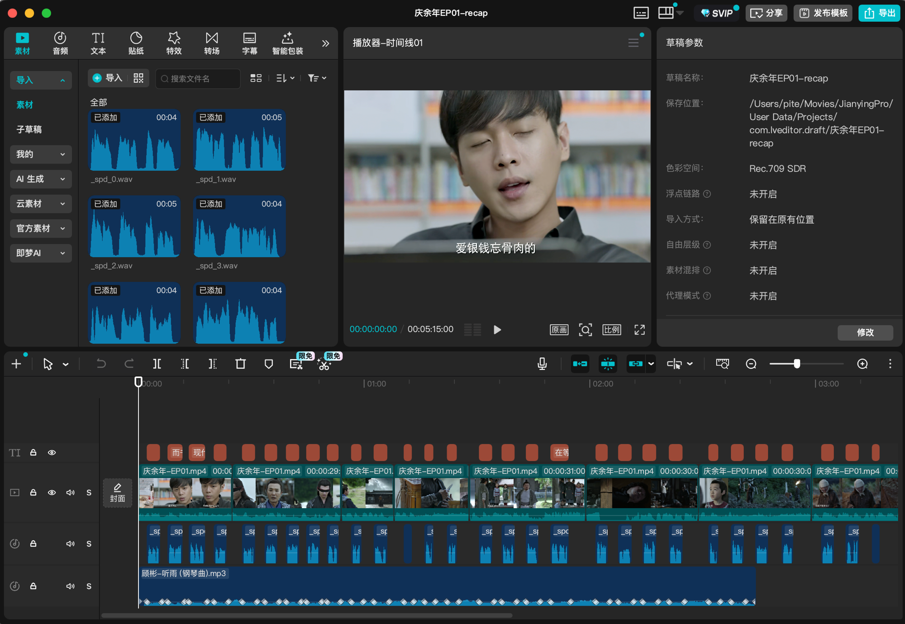
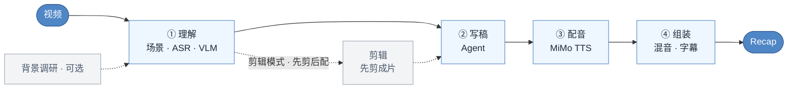

# video-recap-skills

[](LICENSE)


中文 · [English](README.en.md)

**在 claude code 仅需一句话把视频剪辑成解说视频。** 本地只要 `ffmpeg` 加小米 MiMo Token Plan 的 API Key，不用 GPU、不用下载模型，macOS / Linux / Windows 均可运行。

## 演示

<video src="https://github.com/user-attachments/assets/aa96bd1d-ce4b-42bd-a7df-439aeb63dd18" width="640" controls></video>

成片之外，还能一键导出**剪映草稿**手动精修，原片、解说、BGM、字幕：



## 这是什么



## 为什么用它

- **一个 key 跑全程。** ASR、VLM、TTS 全走[小米 MiMo](https://platform.xiaomimimo.com)，本地除了 `ffmpeg` 没别的依赖。
- **该查资料时先查。** 片名/剧情明确或 brief 提示素材偏薄时，把人物关系、剧情背景存进 `background_research.json`，VLM 才更容易认出谁是谁。
- **解说成块，原声也成块。** 解说一段段连着讲、整块一次配音，段间留白把精彩原声整段放回满音量——大致七三开。
- **先剪后配，画面对齐。** `--edit-mode cut` 先把长视频剪成成片，再对着成片写解说，时间轴天然对齐。
- **多视频也能剪，分析可复用。** 一次传多个视频，按 `source_id` 选段剪成一个成片；每个视频的分析沉淀为文件系统素材库，下次 `grep` 复用、不重算。
- **能接着在剪映里改。** 可选导出 schema-driven 的多轨剪映草稿，原片、解说、BGM、字幕各占一轨；ffmpeg 仍是最终成片的判定标准。

## 安装

**① 装插件**——在 claude code 里添加本仓库为插件市场并安装：

```text
/plugin marketplace add worldwonderer/video-recap-skills
/plugin install video-recap-skills@video-recap
```

> 也可以跳过命令，直接对 Claude Code 说：
>
> ```text
> 安装这个插件：https://github.com/worldwonderer/video-recap-skills
> ```

**② 装 ffmpeg**（不用 `pip install`：纯标准库 + `PATH` 上的 `ffmpeg`，Python 3.10+）：

```bash
brew install ffmpeg                        # macOS
sudo apt install ffmpeg                     # Debian/Ubuntu
choco install ffmpeg                        # Windows（或 scoop / winget install ffmpeg）
```

字幕默认烧进画面，需要带 **libass（`subtitles` 滤镜）** 的 ffmpeg——上面这些包基本都自带。如果你的 ffmpeg 没编 libass，开跑前会立刻报错并提示（也可以加 `--no-burn-subtitles` 输出未遮黑条的 MP4 + `.srt` 外挂字幕）。用 `python3 skills/video-recap/scripts/recap.py --doctor` 自检。

**③ 配 MiMo API Key**（一个 key 同时驱动 ASR / VLM / TTS；先在 [platform.xiaomimimo.com](https://platform.xiaomimimo.com) 注册获取）：

```bash
export MIMO_API_KEY=your-mimo-key
# tp-* 的 Token-Plan key 会自动连集群，可选 cn | sgp | ams：
export MIMO_TOKEN_PLAN_CLUSTER=cn
```

按量付费的 `sk-*` key 默认走 `https://api.xiaomimimo.com/v1`。其它都有默认值；想分别配 key/URL 或改模型、音色、响度、字幕等，可见
[配置手册](skills/video-recap/references/config-playbook.md)。

## 在其他 Agent 工具里用（opencode / Codex / OpenClaw）

引擎是纯 Python + ffmpeg + 一个 MiMo key，与具体 Agent 无关，所以也能在别的 Agent CLI 里跑。先备齐共同前置：`PATH` 上有 **ffmpeg**、设好 **`MIMO_API_KEY`**、**Python 3.10+**（同上）。

- **Codex CLI**（已验证）——直接读本仓库的 `.claude-plugin/marketplace.json`：

  ```bash
  codex plugin marketplace add worldwonderer/video-recap-skills
  codex plugin add video-recap-skills@video-recap
  ```

  （仓库 push 后可用 `owner/repo` 形式；本地可用 `codex plugin marketplace add ./video-recap-skills`。）

- **OpenClaw**（已验证）——直接导入 Claude 插件包。克隆本仓库后，把参数指向克隆出的目录运行：

  ```bash
  openclaw plugins install ./video-recap-skills
  ```

  6 个 skill 会成为原生、可自动触发的技能（`openclaw skills list` 可见）。

- **opencode**（按其文档，未在本机实测）——opencode 自动发现 `.claude/skills` / `.agents/skills` / `.opencode/skills` 下的 skill。克隆本仓库后，把 `skills/` 暴露到其中之一即可：

  ```bash
  mkdir -p .claude && ln -s ../skills .claude/skills   # macOS / Linux
  # Windows：先建 .claude\skills 目录，再把 skills\* 复制进去
  ```

> 各 Agent 跑脚本的工作目录不一定是 skill 目录；每个 `SKILL.md` 顶部的「Running the scripts」说明了如何用绝对路径调起（脚本用 `__file__` 自定位）。
> **别重复注册**：同一套 skill 经多条发现路径（仓库 `skills/`、`~/.agents/skills` 拷贝、各 Agent 的安装缓存）同时注册，会命名冲突或重复自动触发——只启用一条。

## 怎么用

把视频丢给它，顺手给点视频背景：

```text
给 /path/to/video.mp4 做个解说。这是《庆余年》第一集，主角是范闲。
```

它会分析视频、照背景写解说，产出带字幕的 `recap_<名>.mp4`。

```text
把 /path/to/long.mp4 剪成十分钟左右的解说短片，字幕压进画面。
```

背后是编排器把几个阶段串起来跑，中间停下来让 Agent 写解说（剪辑模式会停两次：先写 `clip_plan.json` 挑片段，剪成成片后再对着成片写 `narration.json`）。第一次跑前可先自检环境：

多视频剪辑 MVP 只支持剪辑模式：

```bash
python3 skills/video-recap/scripts/recap.py ep1.mp4 ep2.mp4 --edit-mode cut --target-duration 10m --work-dir work_dir_multi_story
```

它会在 `work_dir_multi_story/sources/<source_id>/` 分别沉淀每个源视频的理解产物，在项目级 `multi_source_manifest.json` 里记录 `source_id → source_path`，并要求 `clip_plan.json` 的每个片段写明 `source_id`。

可选素材库也是纯文件系统，方便以后 grep 复用已分析素材：

```bash
python3 skills/video-recap/scripts/recap.py ep1.mp4 --edit-mode cut \
  --material-library-dir .video-materials --save-materials

grep -R "范闲" .video-materials

python3 skills/video-recap/scripts/recap.py ep1.mp4 ep2.mp4 --edit-mode cut \
  --material-library-dir .video-materials --use-materials
```

素材库只保存 JSON/MD 小文件和追加式 `materials_index.jsonl`，不复制原始媒体、不建数据库、不做 embedding/语义搜索。

```bash
python3 skills/video-recap/scripts/recap.py --doctor
```

## 效果增强：贴源字幕与克隆音色解说

本节效果增强适配自 [ops120/video-recap-skills-plus](https://github.com/ops120/video-recap-skills-plus)；感谢 [@ops120](https://github.com/ops120) 公开并维护该下游实现。

让新字幕贴到原视频烧录字幕的位置（自动启用该字幕带遮罩；默认 **0.6 半透明且只在解说时出现**，原声留白保持干净画面）：

```bash
python3 tools/measure_subtitle.py /path/to/video.mp4 --accept-detected
python3 skills/video-recap/scripts/recap.py /path/to/video.mp4 \
  --subtitle-y-top 610 --subtitle-y-bot 660
```

第一条命令仅依赖现有的 Python 标准库 + ffmpeg，会为每个源视频生成 `.subtitle_measure/<视频名-source-id>/preview/` 网格红框预览与带来源信息的 `subtitle_positions.json`；不加 `--accept-detected` 可查看预览后手动确认坐标。坐标属于 ffmpeg 自动旋转后的显示画布，使用半开区间 `[top, bot)`，当前仅支持方形像素（SAR `1:1`）视频，并要求底部对齐字幕（`SUBTITLE_ALIGNMENT=1|2|3`）。遮罩可用 `SUBTITLE_MASK_OPACITY`（`0..1`）和 `SOURCE_SUBTITLE_MASK_TIMING=all|narration` 调整；烧录校订版原声字幕时，对应时间窗会自动使用全不透明遮罩，避免和原片硬字幕重影。

用任意参考音频克隆解说音色（与整轨翻译的 `--edit-mode dub` 不同，这是给 recap 旁白换音色）：

```bash
python3 skills/video-recap/scripts/recap.py /path/to/video.mp4 --voice-ref /path/to/voice-ref.wav
```

参考音频仅在需要生成新 TTS 时转成一次 24 kHz 单声道 WAV，之后所有解说段复用；全量命中缓存时不转码。参考文件内容也进入 TTS 缓存指纹，替换音频后不会误用旧配音。**仅在获得音色所有者授权时使用；参考音频会发送给 MiMo 服务用于合成。**

## 英语视频→中文配音 · 保留原音色

把英文视频翻译成中文，并用**原说话人的音色**配音（克隆，而非固定音色），画面不变。这与「解说」不同：解说在原声上叠加中文评述，配音则把原始台词**替换**成忠实翻译的中文。和解说一样用自然语言触发：

```text
把 /path/to/english.mp4 翻译成中文配音，保留原说话人的声音。
```

它先做英文识别、按句切分、取一段参考音，然后停下来让 Agent 逐句写中文译稿；继续运行即用 `mimo-v2.5-tts-voiceclone` 克隆原音色逐句配音，按**原句时间轴**贴合（只在会超出下一句时才压速，绝不整体提速，避免人声比画面提前结束），整轨替换后输出 `dub_<名>.mp4`。v1：单说话人、整轨替换（暂不保留背景音乐）。

## 架构

| Skill | 职责 | 输入 → 输出（`work_dir` 契约） |
|---|---|---|
| **video-understanding** | 场景检测 · 抽帧 · ASR（`mimo-v2.5-asr`）· VLM（`mimo-v2.5`）· 时间轴融合 · 生成 brief（`--consolidate` 索引默认开） | `视频` → `scenes / asr_result / vlm_analysis / silence_periods / timeline_fusion / agent_narration_brief.md` |
| **video-script** | 写作规则（SKILL.md）+ 评审（LLM 评委）+ lint/校验 | `brief + 索引` → `narration.json` |
| **video-cut** | 片段计划 → 拼剪成片（剪辑模式先剪后配，解说按成片时间轴写，无需重映射） | `clip_plan.json + 视频` → `edited_source.mp4` |
| **video-voiceover** | 合成解说音频（MiMo TTS，`mimo-v2.5-tts`） | `narration.json` → `tts_segments/ + tts_meta.json` |
| **video-assemble** | 混音 · 压低原声 · 渲染字幕 · 多轨时间线（可选导出剪映） | `视频 + tts_meta` → `recap_<名>.mp4 + subtitles.srt/.ass + timeline.json` |
| **video-recap** | 编排器 + `--doctor` | `视频` → `recap_<名>.mp4` |

## 输出

- `recap_<名>.mp4`：成片（固定输出名，每次运行原地覆盖）。`subtitles.srt`（默认烧录字幕，同时产出 `subtitles.ass`；`--no-burn-subtitles` 关闭）
- `work_dir/narration.json`：解说脚本（`narration_lint.json` 时间诊断、`narration_review.md` 评审意见）
- `work_dir/agent_narration_brief.md`：给 Agent 的时间和场景 brief
- `work_dir/vlm_analysis.json` · `asr_result.json` · `silence_periods.json` · `timeline_fusion.json`：理解产物
- `work_dir/clip_plan.json` · `edited_source.mp4` · `recap_phase.json`：剪辑模式产物（解说在成片时间轴上写，`recap_phase.json` 记录剪/配进度供断点续跑）
- `work_dir/multi_source_manifest.json` · `work_dir/sources/<source_id>/`：多视频 cut 的来源清单与每个源视频的理解产物
- `<material-library-dir>/materials/<material_id>/material.json|material.md` · `materials_index.jsonl`：可选素材库，方便 `grep -R` 查找/复用已分析素材
- `work_dir/timeline.json` · `work_dir/assembly_manifest.json` · `tts_segments/` · `tts_meta.json`：多轨时间线、渲染记录与 TTS 音频

## 自带原声字幕（可选，更准）

解说块之间的原声留白会把【原声台词】烧成字幕（用 `「」` 和解说区分开）。默认这份字幕由 Agent 校对、ASR 兜底——但 ASR 时间偏粗，偶尔会和原声对不上。想要更准，直接放一份字幕文件到 `work_dir`，它会作为**首选来源**：

- `work_dir/user_subtitles.json`：`[{"start": 秒, "end": 秒, "text": "台词"}]`，按**成片**时间轴直接使用；或包一层 `{"timeline": "source", "lines": [...]}` 用**原片**时间轴，系统按剪辑计划自动映射到成片。
- `work_dir/user_subtitles.srt` / `.ass`：默认按**原片**时间轴解析并映射到成片。

优先级：**你的字幕文件 › Agent 校对的 `original_subtitles.json` › ASR 兜底**。来源准确时按句精确落到对应留白，不再用粗略的估时。

## 参考文档

- 各 skill 的契约：每个 `skills/<skill>/SKILL.md`（写作规则在 video-script 的 SKILL.md 里）
- [数据结构](skills/video-recap/references/data-schema.md) · [配置手册](skills/video-recap/references/config-playbook.md) · [多轨时间线 / 剪映导出](skills/video-recap/references/timeline-and-jianying.md)
- [背景调研指南](skills/video-understanding/references/research-guide.md) · [VLM prompt 模板](skills/video-understanding/references/prompt-templates.md)

## 致谢

- [linux.do](https://linux.do)
- 剪映草稿导出参考了 [pyJianYingDraft](https://github.com/GuanYixuan/pyJianYingDraft)、[capcut-mate](https://github.com/Hommy-master/capcut-mate)（均 Apache-2.0）的草稿结构。
- 剪映导出的 schema / builder / writer 分层参考了 [duoec/duo-video](https://github.com/duoec/duo-video) 的设计思路。

## 许可

MIT，见 [LICENSE](LICENSE)。
