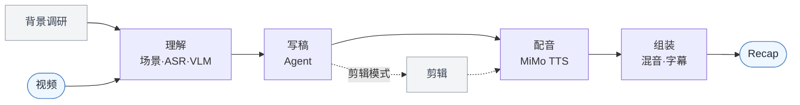

# video-recap-skills

[](LICENSE)


中文 · [English](README.en.md)

**把任何视频做成中文解说 recap——在 Claude Code 里一句话搞定。** 本地只要 `ffmpeg` 和一个小米 MiMo 的 API Key，不要 GPU、不下模型。

## 演示

https://github.com/user-attachments/assets/92698ec6-0d23-4f9f-8825-c3684ef57aff

成片之外，还能一键导出**剪映草稿**接着手动精修——原片片段、解说、BGM、字幕各成一轨，连 ducking 都是可调的音量关键帧：


## 这是什么

一个 Claude Code 插件：五个小而独立的 skill 加一个编排器，各管一段，只靠 `work_dir` 里的 JSON/MP4 传结果。**确定的活儿（剪辑、配音、混音）交给脚本，解说词交给 Agent 写。**



## 为什么用它

- **一个 key 跑全程。** ASR、VLM、TTS 全走[小米 MiMo](https://platform.xiaomimimo.com)，本地只装 `ffmpeg`——不要 GPU、不下模型、不起服务，三平台都能跑。
- **先调研再分析。** 先把剧情人物查清楚写进 `background_research.json`，VLM 读画面时能叫出人名，而不是满屏「黑衣男子」。
- **原声不丢，动态混音。** 解说压低原声后混进去；句子间隙自动让原声和 BGM 顶上来，不留死气。
- **能剪、能审。** `--edit-mode cut` 把长视频压成更短的解说剪辑；出稿前一道 LLM 评审挑幻觉、钩子、主线的毛病。
- **接着在剪映里改。** 可选导出多轨剪映草稿；核心渲染只靠 `ffmpeg`，不装剪映也照常出片。

## 安装

**① 装插件**——对 Claude Code 说：

```text
安装这个插件：https://github.com/worldwonderer/video-recap-skills
```

**② 装 ffmpeg**（流水线本身不用 `pip install`，脚本都是标准库 + `PATH` 上的 `ffmpeg`，Python 3.10+）：

```bash
brew install ffmpeg                        # macOS
sudo apt install ffmpeg                     # Debian/Ubuntu
choco install ffmpeg                        # Windows（或 scoop / winget install ffmpeg）
```

**③ 配 MiMo API Key**（一个 key 同时驱动 ASR / VLM / TTS，放环境变量、别写进仓库）：

```bash
export MIMO_API_KEY=your-mimo-key
# tp-* 的 Token-Plan key 会自动连集群，可选 cn | sgp | ams：
export MIMO_TOKEN_PLAN_CLUSTER=cn
```

按量付费的 `sk-*` key 默认走 `https://api.xiaomimimo.com/v1`。其它都有默认值；想分别配 key/URL 或改模型、音色、响度、字幕等，见
[配置手册](skills/video-recap/references/config-playbook.md)。

## 怎么用

把视频丢给它，顺手给点剧情背景就行：

```text
给 /path/to/video.mp4 做个解说。这是《庆余年》第一集，主角是范闲。
```

它会分析视频、照背景写解说，产出带字幕的 `recap_<名>.mp4`。想要别的花样，照样一句话：

```text
把 /path/to/long.mp4 剪成十分钟左右的解说短片，字幕压进画面。
```

背后是编排器把几个阶段串起来跑，中间停下来让 Agent 写 `narration.json`。第一次跑前先自检环境：

```bash
python3 skills/video-recap/scripts/recap.py --doctor
```

## 架构

`video-recap` 是你直接用的编排器，按子进程依次调起各阶段 skill，轮到写解说词时停下等 Agent。四个纯工具阶段设了 `user-invocable: false` 藏起来，对外只暴露 `video-recap` 和 `video-script`。

| Skill | 职责 | 输入 → 输出（`work_dir` 契约） |
|---|---|---|
| **video-understanding** | 场景检测 · 抽帧 · ASR（`mimo-v2.5-asr`）· VLM（`mimo-v2.5`）· 时间轴融合 · 生成 brief（可选 `--consolidate` 索引） | `视频` → `scenes / asr_result / vlm_analysis / silence_periods / timeline_fusion / agent_narration_brief.md` |
| **video-script** | 写作规则（SKILL.md）+ 评审（LLM 评委）+ lint/校验 | `brief + 索引` → `narration.json` |
| **video-cut** | 片段计划 → 拼剪源 + 重映射解说（剪辑模式） | `clip_plan.json + 视频` → `edited_source.mp4 + narration_mapped.json` |
| **video-voiceover** | 合成解说音频（MiMo TTS，`mimo-v2.5-tts`） | `narration.json` → `tts_segments/ + tts_meta.json` |
| **video-assemble** | 混音 · 压低原声 · 渲染字幕 · 多轨时间线（可选导出剪映） | `视频 + tts_meta` → `recap_<名>.mp4 + subtitles.srt/.ass + timeline.json` |
| **video-recap** | 编排器 + `--doctor` | `视频` → `recap_<名>.mp4` |

每个 skill 自带一份 `lib.py`，相互之间没有共享代码文件，JSON 产物就是唯一的接口。完整参数见各自的 `SKILL.md`。

## 输出

- `recap_<video>.mp4`：成片。`subtitles.srt`（加 `--burn-subtitles` 时还有 `subtitles.ass`）
- `work_dir/narration.json`：解说脚本（`narration_lint.json` 时间诊断、`narration_review.md` 评审意见）
- `work_dir/agent_narration_brief.md`：给 Agent 的时间和场景 brief
- `work_dir/vlm_analysis.json` · `asr_result.json` · `silence_periods.json` · `timeline_fusion.json`：理解产物
- `work_dir/clip_plan.json` · `edited_source.mp4` · `narration_mapped.json`：剪辑模式产物
- `work_dir/timeline.json` · `tts_segments/` · `tts_meta.json`：多轨时间线与 TTS 音频

## 参考文档

- 各 skill 的契约：每个 `skills/<skill>/SKILL.md`（写作规则在 video-script 的 SKILL.md 里）
- [数据结构](skills/video-recap/references/data-schema.md) · [配置手册](skills/video-recap/references/config-playbook.md) · [多轨时间线 / 剪映导出](skills/video-recap/references/timeline-and-jianying.md)
- [背景调研指南](skills/video-understanding/references/research-guide.md) · [VLM prompt 模板](skills/video-understanding/references/prompt-templates.md)

## 致谢

- [linux.do](https://linux.do)
- 剪映草稿导出参考了 [pyJianYingDraft](https://github.com/GuanYixuan/pyJianYingDraft)、[capcut-mate](https://github.com/Hommy-master/capcut-mate)（均 Apache-2.0）的草稿结构，未内置其代码。

## 许可

MIT，见 [LICENSE](LICENSE)。
