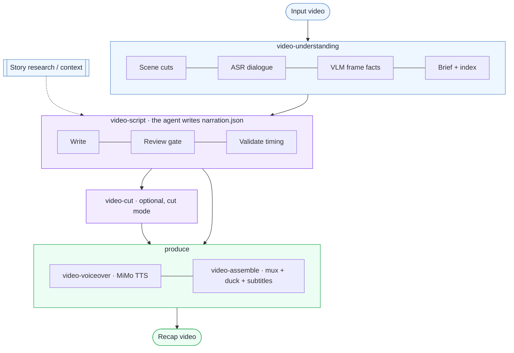

# video-recap-skills

[中文说明](README.zh-CN.md) · English

> A Claude Code **plugin** that turns a video into a Chinese-narration recap — story research, ASR + VLM scene understanding, agent-written narration, TTS voiceover, subtitles, and dynamic audio mixing — built as a bundle of small, independent skills. **Runs on ffmpeg + one Xiaomi MiMo API key.**

[](LICENSE)


## Demo

https://github.com/user-attachments/assets/92698ec6-0d23-4f9f-8825-c3684ef57aff

## What is it?

`video-recap-skills` helps an agent create short-form narrated recap videos from existing video files.
It is a **bundle of five independent skills + a thin orchestrator**. Each stage is a self-contained
skill (its own code, no shared modules); they communicate only through JSON/MP4 artifacts in a
shared `work_dir`. The agent writes the narration; the tooling does the deterministic media work.

**Easy to run:** the entire pipeline — speech-to-text, vision understanding, and text-to-speech —
runs on a single [Xiaomi MiMo](https://platform.xiaomimimo.com) API key plus `ffmpeg`. No GPU,
no local model downloads, no extra services. Works on macOS, Linux, and Windows.



## Architecture — the skill bundle

`video-recap` is the user-facing **orchestrator**; it chains the stage skills (each invoked as a
subprocess) and pauses for the agent to write the narration. The four pure-tool stages are hidden
(`user-invocable: false`); `video-recap` and `video-script` are the ones you invoke.

| Skill | Does | In → Out (the `work_dir` contract) |
|---|---|---|
| **video-understanding** | scene detect · frame extract · ASR (`mimo-v2.5-asr`) · VLM (`mimo-v2.5`) · fuse timeline · build brief (+ optional `--consolidate` index) | `video` → `scenes / asr_result / vlm_analysis / silence_periods / timeline_fusion / agent_narration_brief.md` |
| **video-script** | writing rules (SKILL.md) + review (LLM-as-judge) + lint/validate | `brief + index` → `narration.json` |
| **video-cut** | clip plan → cut source + remap narration (cut mode) | `clip_plan.json + video` → `edited_source.mp4 + narration_mapped.json` |
| **video-voiceover** | synthesize narration audio (MiMo TTS, `mimo-v2.5-tts`) | `narration.json` → `tts_segments/ + tts_meta.json` |
| **video-assemble** | mux · duck original audio · render subtitles | `video + tts_meta` → `recap_<name>.mp4 + subtitles.srt/.ass` |
| **video-recap** | orchestrator + `--doctor` | `video` → `recap_<name>.mp4` |

Each skill ships its own `lib.py` (merged config + utils) — there is **no shared code file**; the
JSON artifacts are the only interface. See each skill's `SKILL.md` for its full options.

## Why use it?

- **One key, runs anywhere** — ASR, VLM, and TTS all go through Xiaomi MiMo's OpenAI-compatible API. The only local dependency is `ffmpeg`; no GPU or model files. macOS / Linux / Windows.
- **Story research before writing** — pull plot, characters, relationships, and world context into the brief so the recap is not visual guesswork.
- **ASR + VLM understanding** — `mimo-v2.5-asr` dialogue transcripts combined with scene cuts, `mimo-v2.5` VLM descriptions, and frame-level facts.
- **Optional 整理 / index build-up** — `--consolidate` rolls per-scene VLM into a global character/relationship/plot index; `--consolidate-asr` cleans the transcript (timing preserved).
- **Quality review gate** — `review.py` grades the draft (hallucination, hook, throughline, density…) as a logged, *advisory* pass; `validate.py` stays the deterministic hard gate.
- **Original audio stays alive** — voiceover is mixed with ducking instead of replacing dialogue and ambience.
- **Script-first reruns** — edit `narration.json`, then rerun voiceover/assembly without redoing video analysis.
- **Cut-style recaps** — `--edit-mode cut` selects source ranges in `clip_plan.json` to turn long videos into shorter narrated edits.

## Installation

### 1. Install the plugin

Ask Claude Code:

```text
Install this plugin: https://github.com/worldwonderer/video-recap-skills
```

### 2. Install ffmpeg

```bash
# macOS
brew install ffmpeg
# Debian/Ubuntu
sudo apt install ffmpeg
# Windows (choose one)
choco install ffmpeg   # or: scoop install ffmpeg   |   winget install ffmpeg
```

Python 3.10+ is the only other requirement — the scripts use the standard library plus `ffmpeg`
on `PATH` (no `pip install` needed for the pipeline itself).

### 3. Set your MiMo API key

One key powers ASR + VLM + TTS. Keep it in an environment variable, never in the repo.

```bash
export MIMO_API_KEY=your-mimo-key
```

- Pay-as-you-go `sk-*` keys default to `https://api.xiaomimimo.com/v1`.
- Token-Plan `tp-*` keys auto-route to the Token-Plan cluster (default `cn`):

```bash
export MIMO_TOKEN_PLAN_CLUSTER=cn   # cn | sgp | ams
# or pin the base URL explicitly: export MIMO_API_URL=https://token-plan-cn.xiaomimimo.com/v1
```

Zero-config otherwise — every overridable env var (models, ASR window, voice, loudness, subtitles…)
is documented in [`skills/video-recap/references/config-playbook.md`](skills/video-recap/references/config-playbook.md).
Advanced: split routes per capability with `MIMO_VIDEO_API_KEY` / `MIMO_TTS_API_KEY` / `MIMO_ASR_API_KEY`
(and the matching `*_API_URL` forms); each falls back to `MIMO_API_KEY` / `MIMO_API_URL`.

## Quick start

After installing, tell Claude Code:

```text
Create a recap video for /path/to/video.mp4 using video-recap.
Context: <show / movie / character background>.
```

The orchestrator runs the understanding stage, then **pauses** with an `agent_narration_brief.md`.
The agent writes `narration.json` (per the **video-script** skill), then you **rerun the same command**
to resume — validate → (cut) → voiceover → assemble.

To drive it manually:

```bash
# 1. Analyze → pause with the brief
python3 skills/video-recap/scripts/recap.py /path/to/video.mp4 --work-dir work_dir \
  --context "show name, characters, or story background" \
  --consolidate                                 # optional: build the global understanding index

# 2. Read work_dir/agent_narration_brief.md, write work_dir/narration.json
#    (optional quality pass): python3 skills/video-script/scripts/review.py --work-dir work_dir

# 3. Rerun the SAME command to produce the recap
python3 skills/video-recap/scripts/recap.py /path/to/video.mp4 --work-dir work_dir
```

**Cut mode** (long video → short narrated edit; target duration is a planning goal):

```bash
python3 skills/video-recap/scripts/recap.py /path/to/video.mp4 --work-dir work_dir \
  --edit-mode cut --target-duration 10m
```

Write both `work_dir/clip_plan.json` and `work_dir/narration.json` in original source time; the
orchestrator builds `edited_source.mp4`, maps narration to `narration_mapped.json`, then resumes.

**Burn subtitles** into the final video (re-encodes; needs an ffmpeg with the `subtitles`/libass filter):

```bash
python3 skills/video-recap/scripts/recap.py /path/to/video.mp4 --work-dir work_dir --burn-subtitles
```

**No dialogue / no key for ASR?** Pass `--skip-asr` to run the pipeline without a transcript.

**Doctor** (ffmpeg filters, MiMo key, ASR/VLM/TTS config):

```bash
python3 skills/video-recap/scripts/recap.py --doctor
```

## Output

- `recap_<video>.mp4` — final recap video · `subtitles.srt` (+ `subtitles.ass` with `--burn-subtitles`)
- `work_dir/agent_narration_brief.md` — timing + scene brief for the agent
- `work_dir/narration.json` — the recap narration script · `work_dir/narration_lint.json` — timing diagnostics
- `work_dir/narration_review.md` — optional review findings (advisory)
- `work_dir/vlm_analysis.json`, `asr_result.json`, `silence_periods.json`, `timeline_fusion.json` — understanding artifacts
- `work_dir/understanding_index.json` / `asr_clean.json` — optional `--consolidate` outputs
- `work_dir/clip_plan.json`, `edited_source.mp4`, `narration_mapped.json` — cut-mode artifacts
- `work_dir/mimo_video_overview.json` — optional MiMo scene-chunk understanding (`--mimo-video-overview`)
- `work_dir/tts_segments/`, `tts_meta.json` — TTS audio + placement

## Development

Each skill ships its own `lib.py`, so tests run **one process per skill** (a plain `pytest tests/`
would collide on the `lib` module name):

```bash
bash scripts/test.sh                 # all skills (or: bash scripts/test.sh script)
# Windows (no bash): run each group, e.g. python -m pytest tests/script
ruff check skills tests              # lint
python3 skills/video-recap/scripts/recap.py --doctor   # runtime check
```

Tests live in `tests/<skill>/`. CI runs the same checks (`.github/workflows/skill-validate.yml`).

## Useful references

- Per-skill contracts: each `skills/<skill>/SKILL.md` (video-script's SKILL.md carries the writing rules)
- [Data schema](skills/video-recap/references/data-schema.md) · [Config playbook](skills/video-recap/references/config-playbook.md)
- [Background research guide](skills/video-understanding/references/research-guide.md) · [VLM prompt templates](skills/video-understanding/references/prompt-templates.md)

## Acknowledgements

- [Xiaomi MiMo](https://platform.xiaomimimo.com) — ASR (`mimo-v2.5-asr`), VLM (`mimo-v2.5`), and TTS (`mimo-v2.5-tts`)
- [linux.do](https://linux.do)

## License

MIT — see [LICENSE](LICENSE).
