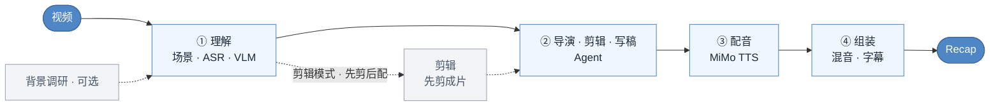

# video-recap-skills

[](LICENSE)


中文 · [English](README.en.md)

**在 Claude Code、Codex CLI、OpenCode 或 OpenClaw 里，用一句自然语言把视频变成中文解说成片。** 本地只需要 Python、`ffmpeg` 和一个小米 MiMo API Key；不用 GPU，不用下载模型，macOS / Linux / Windows 均可运行。

## 演示

<video src="https://github.com/user-attachments/assets/aa96bd1d-ce4b-42bd-a7df-439aeb63dd18" width="640" controls></video>

成片之外，还能一键导出**剪映草稿**手动精修，原片、解说、BGM、字幕：


## 这是什么



## 为什么用它

- **一个 key 跑全程。** ASR、VLM、TTS 全走[小米 MiMo](https://platform.xiaomimimo.com)；本地运行时只有 Python 标准库和 `ffmpeg`，不用 `pip install`。
- **该查资料时先查。** 片名/剧情明确或 brief 提示素材偏薄时，把人物关系、剧情背景存进 `background_research.json`，VLM 才更容易认出谁是谁。
- **先做创作决定，再分配声音。** Agent 先比较剪辑假设，锁定 POV、主线、具体画面与原声锚点；旁白有明确任务时才整块配音，强对白、动作声或沉默可以完整主导一个 beat。七三开只是在素材判断不足时的粗略回退，不是配额。
- **先剪后配，画面对齐。** 剪辑模式先把长视频剪成成片，再对着成片写解说，时间轴天然对齐。
- **多视频也能剪，分析可复用。** 一次传多个视频，按 `source_id` 选段剪成一个成片；每个视频的分析沉淀为文件系统素材库，下次 `grep` 复用、不重算。
- **能接着在剪映里改。** 可选导出 schema-driven 的多轨剪映草稿，原片、解说、BGM、字幕和本地图片叠层都可编辑；视频/音频/图片默认打包进 `Resources/local` 并建立素材索引，clone 或搬目录后仍可用。ffmpeg 仍是最终成片的判定标准。
- **可选 MiMo 成片顾问，不当门神。** 需要时可让 MiMo 在合成前或成片后给出语义/审美建议；缺 key、限流、超时或模型输出异常都只提示，绝不阻断或自动改片。

## 安装

### 1. 通用前置

- Python 3.10+
- `PATH` 上可用的 `ffmpeg`；默认烧录字幕，因此需要带 libass / `subtitles` 滤镜
- 一个[小米 MiMo](https://platform.xiaomimimo.com) API Key，同时驱动 ASR、VLM 和 TTS

```bash
brew install ffmpeg                         # macOS
sudo apt install ffmpeg                    # Debian / Ubuntu
choco install ffmpeg                       # Windows，也可用 scoop / winget

export MIMO_API_KEY=your-mimo-key          # macOS / Linux
export MIMO_TOKEN_PLAN_CLUSTER=cn          # tp-* key 可选：cn | sgp | ams
```

Windows PowerShell 使用 `$env:MIMO_API_KEY="your-mimo-key"`。按量付费的 `sk-*` key 默认连接 `https://api.xiaomimimo.com/v1`；模型、音色、响度和字幕等高级配置见[配置手册](skills/video-recap/references/config-playbook.md)。

### 2. 选择 Agent 宿主

#### Claude Code

在 Claude Code 内执行：

```text
/plugin marketplace add worldwonderer/video-recap-skills
/plugin install video-recap-skills@video-recap
```

也可以直接说：

```text
安装这个插件：https://github.com/worldwonderer/video-recap-skills
```

#### Codex CLI

```bash
codex plugin marketplace add worldwonderer/video-recap-skills
codex plugin add video-recap-skills@video-recap
```

本地仓库可把第一条命令的源换成目录路径。以上流程已使用隔离的 `CODEX_HOME` 在 Codex CLI `0.144.1` 完成安装烟测。

#### OpenCode

[OpenCode 官方 Agent Skills 文档](https://opencode.ai/docs/skills/)规定项目级技能放在 `.opencode/skills/<name>/SKILL.md`。克隆仓库后，从仓库目录启动 OpenCode：

```bash
git clone https://github.com/worldwonderer/video-recap-skills.git
cd video-recap-skills
mkdir -p .opencode
ln -s ../skills .opencode/skills             # macOS / Linux
opencode debug skill
```

Windows 可把 `skills\*` 复制到 `.opencode\skills\`。本 PR 已在 OpenCode `1.14.32` 上实际验证：`opencode debug skill` 能发现全部 6 个技能。日常端到端制作使用 `video-recap`；只做策划或写稿时可调用 `video-script`；其余四个技能负责工具阶段。

#### OpenClaw

克隆仓库后导入 Claude 插件包，并检查技能列表：

```bash
openclaw plugins install ./video-recap-skills
openclaw skills list
```

不要把同一份技能同时注册到多个发现目录，否则可能出现重名或重复触发。

安装完成后，可以让 Agent 自检环境：

```text
检查 video-recap 的运行环境，告诉我 Python、ffmpeg/libass 和 MiMo 配置是否就绪。
```

## 怎么用

直接给出视频路径、期望成片和必要背景。用户不需要手动运行仓库里的 Python 脚本。

**完整视频解说：**

```text
给 /path/to/video.mp4 做一个中文解说成片。这是《庆余年》第一集，主角是范闲，字幕烧进画面。
```

**长视频剪成短解说：**

```text
把 /path/to/long.mp4 剪成十分钟左右的解说短片，保留关键原声和人物反应。
```

**多视频合成一个故事：**

```text
用 /path/to/ep1.mp4 和 /path/to/ep2.mp4 做一个十分钟解说，围绕同一条主线剪辑，不要分成两个小总结。
```

Agent 会自动完成理解、故事与视听规划、剪辑、写稿、配音和合成。剪辑模式内部会先确定保留片段，生成剪后成片后再按输出时间轴写旁白；这些暂停和续跑也由 Agent 处理。

## 常用进阶需求

**复用已经分析过的素材：**

```text
分析 /path/to/ep1.mp4，并把可复用的理解产物保存到 /path/to/.video-materials；后续制作时优先复用这个素材库。
```

素材库只保存 JSON / Markdown 和索引，不复制原始媒体、不建数据库、不做 embedding。需要检索时，Agent 直接在文件系统中查找。

**增加建议型质量复核并导出剪映草稿：**

```text
给 /path/to/video.mp4 做解说，合成前和成片后都做 MiMo 质量复核，并导出可继续编辑的剪映草稿。
```

MiMo 复核始终是 advisory：每个阶段最多一次请求，失败开放，不会自动修改或阻断成片。

**让新字幕贴合原片硬字幕位置：**

```text
先检测 /path/to/video.mp4 的原片字幕区域并让我确认预览，再把解说字幕贴到同一区域生成成片。
```

检测结果会保存在 `.subtitle_measure/` 下供确认；当前要求方形像素视频和底部对齐字幕。该能力适配自 [ops120/video-recap-skills-plus](https://github.com/ops120/video-recap-skills-plus)。

**克隆有授权的参考音色：**

```text
用 /path/to/voice-ref.wav 的音色给 /path/to/video.mp4 做解说；我已获得音色所有者授权。
```

参考音频会发送给 MiMo 用于合成，其内容指纹参与缓存校验。仅在获得音色所有者授权时使用。

**英语视频译成中文并保留原音色：**

```text
把 /path/to/english.mp4 翻译成中文配音，保留原说话人的声音。
```

这会替换原始台词，而不是在原声上叠加解说。当前版本支持单说话人整轨替换，暂不分离背景音乐。

## 架构

| Skill | 职责 | 输入 → 输出（`work_dir` 契约） |
|---|---|---|
| **video-understanding** | 场景检测 · 抽帧 · ASR（`mimo-v2.5-asr`）· VLM（`mimo-v2.5`）· 时间轴融合 · 生成 brief | `视频` → `scenes / asr_result / vlm_analysis / silence_periods / timeline_fusion / agent_narration_brief.md` |
| **video-script** | 导演/故事/画面/声音方案 + 解说写作 + 建议型评审 + lint/校验 | `brief + 索引` → `recap_story_plan.json + visual_audio_board.json + [clip_plan.json] + narration.json` |
| **video-cut** | 片段计划 → 拼剪成片（剪辑模式先剪后配，解说按成片时间轴写，无需重映射） | `clip_plan.json + 视频` → `edited_source.mp4` |
| **video-voiceover** | 合成解说音频（MiMo TTS，`mimo-v2.5-tts`） | `narration.json` → `tts_segments/ + tts_meta.json` |
| **video-assemble** | 混音 · 压低原声 · 渲染字幕 · 多轨时间线（可选导出剪映） | `视频 + tts_meta` → `recap_<名>.mp4 + subtitles.srt/.ass + timeline.json` |
| **video-recap** | 编排器与环境诊断 | `视频` → `recap_<名>.mp4` |

## 输出

- `recap_<名>.mp4`：成片（固定输出名，每次运行原地覆盖）；字幕默认烧录，同时产出 `subtitles.srt` 与 `subtitles.ass`
- `work_dir/narration.json`：解说脚本（`narration_lint.json` 时间诊断、`narration_review.md` 评审意见）
- `work_dir/recap_story_plan.json` · `visual_audio_board.json`：Agent 的故事、画面与声音决定；供续写和建议型评审使用，不是渲染硬门禁
- `work_dir/agent_narration_brief.md`：给 Agent 的时间和场景 brief
- `work_dir/vlm_analysis.json` · `asr_result.json` · `silence_periods.json` · `timeline_fusion.json`：理解产物
- `work_dir/clip_plan.json` · `edited_source.mp4` · `recap_phase.json`：剪辑模式产物（解说在成片时间轴上写，`recap_phase.json` 记录剪/配进度供断点续跑）
- `work_dir/multi_source_manifest.json` · `work_dir/sources/<source_id>/`：多视频 cut 的来源清单与每个源视频的理解产物
- `<material-library-dir>/materials/<material_id>/material.json|material.md` · `materials_index.jsonl`：可选素材库，方便 `grep -R` 查找/复用已分析素材
- `work_dir/timeline.json` · `work_dir/assembly_manifest.json` · `tts_segments/` · `tts_meta.json`：多轨时间线、渲染记录与 TTS 音频
- `work_dir/mimo_qc.json`：可选的组装前/成片后 MiMo 建议（多阶段聚合、永不阻断）

## 自带原声字幕（可选，更准）

解说块之间的原声留白会把【原声台词】烧成字幕（用 `「」` 和解说区分开）。默认这份字幕由 Agent 校对、ASR 兜底——但 ASR 时间偏粗，偶尔会和原声对不上。想要更准，直接放一份字幕文件到 `work_dir`，它会作为**首选来源**：

- `work_dir/user_subtitles.json`：`[{"start": 秒, "end": 秒, "text": "台词"}]`，按**成片**时间轴直接使用；或包一层 `{"timeline": "source", "lines": [...]}` 用**原片**时间轴，系统按剪辑计划自动映射到成片。
- `work_dir/user_subtitles.srt` / `.ass`：默认按**原片**时间轴解析并映射到成片。

优先级：**你的字幕文件 › Agent 校对的 `original_subtitles.json` › ASR 兜底**。来源准确时按句精确落到对应留白，不再用粗略的估时。

## 参考文档

- 各 skill 的契约：每个 `skills/<skill>/SKILL.md`（写作规则在 video-script 的 SKILL.md 里）
- [数据结构](skills/video-recap/references/data-schema.md) · [配置手册](skills/video-recap/references/config-playbook.md) · [多轨时间线 / 剪映导出](skills/video-recap/references/timeline-and-jianying.md)
- [背景调研指南](skills/video-recap/references/research-guide.md) · [VLM prompt 模板](skills/video-understanding/references/prompt-templates.md)

## 致谢

- [linux.do](https://linux.do)
- 剪映草稿协议参考 [pyJianYingDraft](https://github.com/GuanYixuan/pyJianYingDraft)、[capcut-mate](https://github.com/Hommy-master/capcut-mate) 和 [duo-video](https://github.com/duoec/duo-video)。

## 许可

MIT，见 [LICENSE](LICENSE)。
