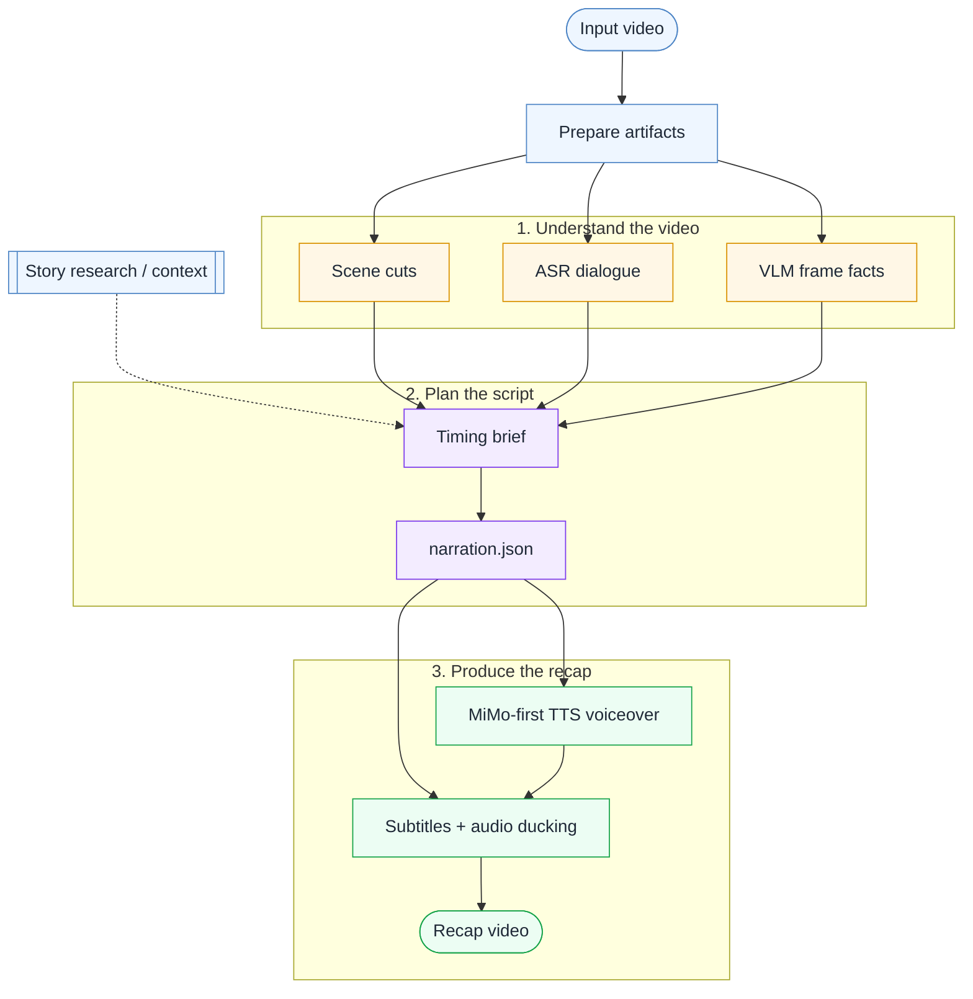

# video-recap

[中文说明](README.zh-CN.md) · English

> A Claude Code skill for turning videos into recap videos with story research, ASR+VLM scene understanding, TTS voiceover, subtitles, and dynamic audio mixing.

[](LICENSE)


## Demo

https://github.com/user-attachments/assets/92698ec6-0d23-4f9f-8825-c3684ef57aff

## What is it?

`video-recap` is a Claude Code skill that helps an agent create short-form recap videos from existing video files.



## Why use it?

- **Story research before writing** — pull plot, characters, relationships, and world context into the brief so the recap is not just visual guesswork.
- **ASR + VLM understanding** — combine dialogue transcripts with scene cuts, VLM descriptions, and frame-level facts.
- **Timing-aware writing brief** — `agent_narration_brief.md` includes quiet windows, dialogue overlap, scene timing, and word budgets.
- **Original audio stays alive** — voiceover is mixed with ducking instead of replacing dialogue, ambience, and rhythm.
- **Script-first reruns** — edit `narration.json`, then rerun TTS/assembly without redoing video analysis.
- **Cut-style recaps** — in `--edit-mode cut`, select source ranges in `clip_plan.json` to turn long videos into shorter narrated edits.
- **MiMo-first TTS support** — `--tts` supports `auto`, `edge-tts`, and `mimo-tts`; the default `auto` picks MiMo TTS when a MiMo key is configured, otherwise falls back to `edge-tts`.
- **No-key fallback** — without MiMo configuration, `edge-tts` with `zh-CN-YunxiNeural` remains the fallback.

## Installation

### 1. Install the Claude Code skill

Ask Claude Code:

```text
Install this skill: https://github.com/worldwonderer/video-recap
```

### 2. Install runtime dependencies

```bash
brew install ffmpeg
pip3 install edge-tts
```

### 3. Configure an OpenAI-compatible API

```bash
export OPENAI_API_KEY=your-key
export OPENAI_API_URL=https://your-api-url/v1
export OPENAI_MODEL=doubao-seed-2-0-lite-260428

# Recommended when your proxy/provider is sensitive to concurrent VLM requests:
export VLM_WORKERS=1
```

### Optional: Xiaomi MiMo

MiMo is supported for optional scene-chunk video understanding and MiMo TTS.
Keep keys in environment variables only; do not write them into repo files.

Simple mixed-provider setup: use your OpenAI-compatible endpoint (for example Doubao)
for frame VLM, and one MiMo key for both video understanding and TTS.

```bash
export OPENAI_API_KEY=your-doubao-or-vlm-key
export OPENAI_API_URL=https://your-vlm-api-url/v1
export OPENAI_MODEL=doubao-seed-2-0-lite-260428

export MIMO_API_KEY=your-mimo-key
export MIMO_MODEL=mimo-v2.5

# Pay-as-you-go sk-* keys default to https://api.xiaomimimo.com/v1.
# Token Plan tp-* keys default to the China cluster:
#   https://token-plan-cn.xiaomimimo.com/v1
# Override when your subscription is in another cluster:
export MIMO_TOKEN_PLAN_CLUSTER=cn   # cn | sgp | ams
# or set the exact base URL:
# export MIMO_API_URL=https://token-plan-cn.xiaomimimo.com/v1
```

MiMo video understanding is scene-chunk only: ffmpeg `scdet` finds scene
boundaries, each local chunk is cut to MP4, encoded as a `data:video/mp4;base64,...`
`video_url`, and sent to MiMo. The pipeline always analyzes these local scene
chunks rather than bypassing segmentation. Keep each chunk under the configured
base64 limit (default 45 MB safety limit for MiMo's 50 MB base64 cap); reduce
`MIMO_VIDEO_CHUNK_MAX_SECONDS` or `MIMO_VIDEO_FPS` if a chunk is too large.

Advanced routing is optional: `MIMO_API_KEY` / `MIMO_API_URL` feed both MiMo video
and MiMo TTS by default. Only split the two MiMo routes when needed with
`MIMO_VIDEO_API_URL` / `MIMO_TTS_API_URL` (and, for different credentials,
`MIMO_VIDEO_API_KEY` / `MIMO_TTS_API_KEY`).

## Quick start

After installing the skill, tell Claude Code:

```text
Create a recap video for /path/to/video.mp4 using video-recap.
Prefer MiMo TTS; if no MiMo key is configured, fall back to edge-tts. Context: <show / movie / character background>.
```

The pipeline prepares scene, ASR, and visual-analysis artifacts, then pauses with an `agent_narration_brief.md`. The agent writes `narration.json`, and the CLI resumes to synthesize voiceover and assemble the video.

If you want to start the first analysis pass manually:

```bash
python3 skills/video-recap/scripts/video_recap.py /path/to/video.mp4 \
  --context "show name, characters, or story background"
```

For a mixed Doubao + MiMo run (Doubao frame VLM, MiMo scene-chunk video context, MiMo TTS):

```bash
python3 skills/video-recap/scripts/video_recap.py /path/to/video.mp4 \
  --vlm-model doubao-seed-2-0-lite-260428 \
  --mimo-video-overview \
  --mimo-tts-voice 冰糖
```

The command pauses before TTS and prints a `work_dir`. Read `work_dir/agent_narration_brief.md`, write `work_dir/narration.json`, then run the printed resume command.

To validate the agent-written script before TTS, run `--step script` after writing `narration.json`. This writes `work_dir/narration_lint.json` with timing errors and warnings.

For an edited recap that keeps only selected source moments (target duration is a planning goal):

```bash
python3 skills/video-recap/scripts/video_recap.py /path/to/video.mp4 \
  --edit-mode cut \
  --target-duration 10m
```

In cut mode, write both `work_dir/clip_plan.json` and `work_dir/narration.json` using original source timestamps. The CLI builds `edited_source.mp4`, maps narration into `narration_mapped.json`, then resumes TTS/assembly.

To hardcode the narration subtitles into the final video, add `--burn-subtitles` on the resume/assembly run:

```bash
python3 skills/video-recap/scripts/video_recap.py /path/to/video.mp4 \
  --resume work_dir \
  --burn-subtitles
```

The CLI exports `subtitles.srt` from the final `narration.json` and TTS placement. Burn-in uses an internal `subtitles.ass` renderer with readable bottom subtitles and re-encodes the video, so your `ffmpeg` build must include the `subtitles`/libass filter.

### Doctor check

```bash
python3 skills/video-recap/scripts/video_recap.py --doctor
```

Use `--doctor-tts-smoke` when you also want a short fallback `edge-tts` synthesis check. The doctor also reports ffmpeg subtitle-filter support, ASR path/model readiness, normalized API configuration, and the default TTS setup.

## Output

Typical outputs:

- `recap_<video>.mp4` — final recap video
- `work_dir/subtitles.srt` — voiceover/narration subtitles generated from final TTS placement
- `work_dir/subtitles.ass` — internal narration subtitle file used for burn-in when `--burn-subtitles` is enabled
- `work_dir/agent_narration_brief.md` — timing and scene brief for the agent
- `work_dir/narration.json` — recap narration script
- `work_dir/narration_lint.json` — script timing/preflight diagnostics from `--step script` or resume validation
- `work_dir/clip_plan.json` — source ranges to keep when `--edit-mode cut` is used
- `work_dir/edited_source.mp4` — concatenated short source video in cut mode
- `work_dir/narration_mapped.json` — narration mapped from source time to edited-output time
- `work_dir/vlm_analysis.json` — scene-level visual analysis
- `work_dir/mimo_video_overview.json` — optional MiMo scene-chunk video-understanding artifact
- `work_dir/asr_result.json` — ASR result when available; used as recap context
- `work_dir/tts_segments/` — generated TTS audio segments

## Useful references

- [Skill contract](skills/video-recap/SKILL.md)
- [Agent workflow](skills/video-recap/references/agent-mode-workflow.md)
- [Parameters](skills/video-recap/references/parameters.md)
- [Prompt templates](skills/video-recap/references/prompt-templates.md)
- [Resume and partial reruns](skills/video-recap/references/pipeline-resume.md)
- [Data schema](skills/video-recap/references/data-schema.md)

## Acknowledgements

- [linux.do](https://linux.do)
- [qwen3-asr-rs](https://github.com/alan890104/qwen3-asr-rs)

## License

MIT — see [LICENSE](LICENSE).
