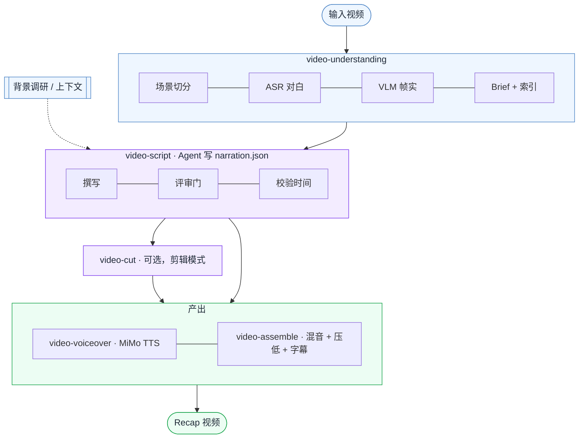

# video-recap-skills

中文说明 · [English](README.md)

> 一个把视频转成中文解说 recap 的 Claude Code **插件**——背景调研、ASR + VLM 场景理解、Agent 撰写解说词、TTS 配音、字幕、动态混音——由一组小而独立的 skill 组合而成。**只需 ffmpeg + 一个小米 MiMo API key 即可运行。**

[](LICENSE)


## 演示

https://github.com/user-attachments/assets/92698ec6-0d23-4f9f-8825-c3684ef57aff

## 这是什么？

`video-recap-skills` 帮 Agent 把已有视频做成短篇带解说的 recap 视频。它是 **五个独立 skill + 一个轻量编排器** 的组合：每个阶段都是自包含的 skill（各自带代码，不共享模块），它们只通过共享 `work_dir` 里的 JSON/MP4 产物通信。解说词由 Agent 撰写，确定性的多媒体处理交给脚本。

**易于运行：** 整条流水线——语音转写、画面理解、语音合成——都跑在一个 [小米 MiMo](https://platform.xiaomimimo.com) API key 加 `ffmpeg` 上。无需 GPU、无需下载本地模型、无需额外服务。支持 macOS、Linux、Windows。



## 架构 —— skill 组合

`video-recap` 是面向用户的**编排器**，它把各阶段 skill（以子进程方式）串起来，并在需要 Agent 写解说词时暂停。四个纯工具阶段是隐藏的（`user-invocable: false`）；你直接调用的是 `video-recap` 和 `video-script`。

| Skill | 职责 | 输入 → 输出（`work_dir` 契约） |
|---|---|---|
| **video-understanding** | 场景检测 · 抽帧 · ASR（`mimo-v2.5-asr`）· VLM（`mimo-v2.5`）· 时间轴融合 · 生成 brief（可选 `--consolidate` 索引） | `视频` → `scenes / asr_result / vlm_analysis / silence_periods / timeline_fusion / agent_narration_brief.md` |
| **video-script** | 写作规则（SKILL.md）+ 评审（LLM 评委）+ lint/校验 | `brief + 索引` → `narration.json` |
| **video-cut** | 片段计划 → 拼剪源 + 重映射解说（剪辑模式） | `clip_plan.json + 视频` → `edited_source.mp4 + narration_mapped.json` |
| **video-voiceover** | 合成解说音频（MiMo TTS，`mimo-v2.5-tts`） | `narration.json` → `tts_segments/ + tts_meta.json` |
| **video-assemble** | 混音 · 压低原声 · 渲染字幕 | `视频 + tts_meta` → `recap_<名>.mp4 + subtitles.srt/.ass` |
| **video-recap** | 编排器 + `--doctor` | `视频` → `recap_<名>.mp4` |

每个 skill 自带 `lib.py`（合并的配置 + 工具）——**没有任何共享代码文件**，JSON 产物是唯一接口。各 skill 的完整参数见其 `SKILL.md`。

## 为什么用它？

- **一个 key，到处能跑**——ASR、VLM、TTS 全部走小米 MiMo 的 OpenAI 兼容 API。本地唯一依赖是 `ffmpeg`，不需要 GPU 或模型文件。macOS / Linux / Windows 通用。
- **先调研再写稿**——把剧情、人物、关系、世界观写进 brief，解说不靠看图猜。
- **ASR + VLM 理解**——`mimo-v2.5-asr` 对白转写结合场景切分、`mimo-v2.5` VLM 画面描述与帧级事实。
- **可选「整理 / 索引」**——`--consolidate` 把逐场景 VLM 汇总成全局人物/关系/剧情索引；`--consolidate-asr` 清洗转写（时间戳保持不变）。
- **质量评审门**——`review.py` 对草稿打分（幻觉、钩子、主线、密度……），作为**建议性**的有记录的评审；`validate.py` 仍是确定性的硬门。
- **保留原声**——配音以压低（ducking）方式混入，而不是盖掉对白与环境声。
- **改稿即重跑**——改 `narration.json` 后重跑配音/组装，无需重做视频分析。
- **剪辑式 recap**——`--edit-mode cut` 在 `clip_plan.json` 中选取原片片段，把长视频做成更短的带解说剪辑。

## 安装

### 1. 安装插件

对 Claude Code 说：

```text
安装这个插件：https://github.com/worldwonderer/video-recap-skills
```

### 2. 安装 ffmpeg

```bash
# macOS
brew install ffmpeg
# Debian/Ubuntu
sudo apt install ffmpeg
# Windows（任选其一）
choco install ffmpeg   # 或：scoop install ffmpeg   |   winget install ffmpeg
```

除 ffmpeg 外只需 Python 3.10+——脚本只用标准库加 `PATH` 上的 `ffmpeg`（流水线本身无需 `pip install`）。

### 3. 配置 MiMo API key

一个 key 同时驱动 ASR + VLM + TTS。只放环境变量，不要写进仓库。

```bash
export MIMO_API_KEY=your-mimo-key
```

- 按量付费 `sk-*` key 默认 `https://api.xiaomimimo.com/v1`。
- Token-Plan `tp-*` key 自动走 Token-Plan 集群（默认 `cn`）：

```bash
export MIMO_TOKEN_PLAN_CLUSTER=cn   # cn | sgp | ams
# 或直接指定 base URL：export MIMO_API_URL=https://token-plan-cn.xiaomimimo.com/v1
```

其余均为零配置默认值，所有可覆盖的环境变量（模型、ASR 分段、音色、响度、字幕……）见
[`skills/video-recap/references/config-playbook.md`](skills/video-recap/references/config-playbook.md)。
进阶：可用 `MIMO_VIDEO_API_KEY` / `MIMO_TTS_API_KEY` / `MIMO_ASR_API_KEY`（及对应 `*_API_URL`）按能力拆分路由，
各自回退到 `MIMO_API_KEY` / `MIMO_API_URL`。

## 快速开始

安装后对 Claude Code 说：

```text
用 video-recap 给 /path/to/video.mp4 做一个解说视频。
上下文：<剧名 / 电影 / 人物背景>。
```

编排器先跑理解阶段，然后带着 `agent_narration_brief.md` **暂停**。Agent 按 **video-script** skill 写 `narration.json`，随后你**重跑同一条命令**继续——校验 →（剪辑）→ 配音 → 组装。

手动驱动：

```bash
# 1. 分析 → 暂停并给出 brief
python3 skills/video-recap/scripts/recap.py /path/to/video.mp4 --work-dir work_dir \
  --context "剧名、人物或剧情背景" \
  --consolidate                                 # 可选：构建全局理解索引

# 2. 阅读 work_dir/agent_narration_brief.md，写 work_dir/narration.json
#    （可选质量评审）：python3 skills/video-script/scripts/review.py --work-dir work_dir

# 3. 重跑同一条命令产出 recap
python3 skills/video-recap/scripts/recap.py /path/to/video.mp4 --work-dir work_dir
```

**剪辑模式**（长视频 → 短解说剪辑；目标时长是规划目标）：

```bash
python3 skills/video-recap/scripts/recap.py /path/to/video.mp4 --work-dir work_dir \
  --edit-mode cut --target-duration 10m
```

用原视频时间写 `work_dir/clip_plan.json` 和 `work_dir/narration.json`；编排器会拼出
`edited_source.mp4`，把解说映射到 `narration_mapped.json`，然后继续。

**压制字幕**进最终视频（会重编码；需要带 `subtitles`/libass 滤镜的 ffmpeg）：

```bash
python3 skills/video-recap/scripts/recap.py /path/to/video.mp4 --work-dir work_dir --burn-subtitles
```

**没有对白 / 不想用 ASR？** 加 `--skip-asr` 即可不带转写跑完整条流水线。

**自检**（ffmpeg 滤镜、MiMo key、ASR/VLM/TTS 配置）：

```bash
python3 skills/video-recap/scripts/recap.py --doctor
```

## 输出

- `recap_<video>.mp4` —— 最终 recap 视频 · `subtitles.srt`（加 `--burn-subtitles` 时另有 `subtitles.ass`）
- `work_dir/agent_narration_brief.md` —— 给 Agent 的时间/场景 brief
- `work_dir/narration.json` —— 解说脚本 · `work_dir/narration_lint.json` —— 时间诊断
- `work_dir/narration_review.md` —— 可选评审意见（建议性）
- `work_dir/vlm_analysis.json`、`asr_result.json`、`silence_periods.json`、`timeline_fusion.json` —— 理解产物
- `work_dir/understanding_index.json` / `asr_clean.json` —— 可选 `--consolidate` 产物
- `work_dir/clip_plan.json`、`edited_source.mp4`、`narration_mapped.json` —— 剪辑模式产物
- `work_dir/mimo_video_overview.json` —— 可选 MiMo 分片理解（`--mimo-video-overview`）
- `work_dir/tts_segments/`、`tts_meta.json` —— TTS 音频与放置信息

## 开发

每个 skill 自带 `lib.py`，所以测试要**每个 skill 一个进程**跑（直接 `pytest tests/` 会因 `lib` 模块同名冲突）：

```bash
bash scripts/test.sh                 # 全部（或：bash scripts/test.sh script）
# Windows（无 bash）：逐组运行，如 python -m pytest tests/script
ruff check skills tests              # lint
python3 skills/video-recap/scripts/recap.py --doctor   # 运行时自检
```

测试位于 `tests/<skill>/`，CI 跑同样的检查（`.github/workflows/skill-validate.yml`）。

## 参考文档

- 各 skill 契约：每个 `skills/<skill>/SKILL.md`（写作规则在 video-script 的 SKILL.md）
- [数据结构](skills/video-recap/references/data-schema.md) · [配置手册](skills/video-recap/references/config-playbook.md)
- [背景调研指南](skills/video-understanding/references/research-guide.md) · [VLM prompt 模板](skills/video-understanding/references/prompt-templates.md)

## 致谢

- [小米 MiMo](https://platform.xiaomimimo.com) —— ASR（`mimo-v2.5-asr`）、VLM（`mimo-v2.5`）、TTS（`mimo-v2.5-tts`）
- [linux.do](https://linux.do)

## 许可

MIT —— 见 [LICENSE](LICENSE)。
