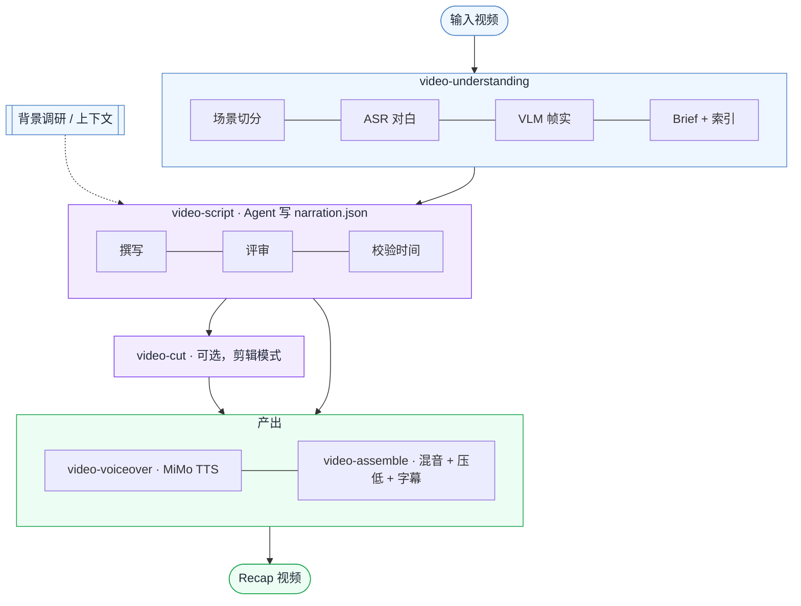

# video-recap-skills

中文说明 · [English](README.md)

> 把视频做成中文解说 recap 的 Claude Code 插件。一条流水线串起背景调研、ASR + VLM 场景理解、Agent 写解说词、TTS 配音、字幕和动态混音，由一组小而独立的 skill 拼起来。跑起来只要 ffmpeg 和一个小米 MiMo 的 API Key。

[](LICENSE)


## 演示

https://github.com/user-attachments/assets/92698ec6-0d23-4f9f-8825-c3684ef57aff

## 这是什么

`video-recap-skills` 让 Agent 把已有视频做成短篇解说 recap。它由五个独立 skill 加一个编排器组成，每个 skill 各管一段，彼此不共享代码，只靠 `work_dir` 里的 JSON/MP4 文件传结果。解说词交给 Agent 写，剪辑、配音、混音这些确定的活儿交给脚本。

好上手的地方在于：语音转写、画面理解、语音合成全都走 [小米 MiMo](https://platform.xiaomimimo.com)，本地只装一个 `ffmpeg`。不碰 GPU，不下模型，也不用另起服务，macOS、Linux、Windows 都能跑。



## 架构

`video-recap` 是你直接用的编排器。它按子进程依次调起各阶段 skill，轮到写解说词时停下来等 Agent。四个纯工具阶段设了 `user-invocable: false` 藏起来，对外只暴露 `video-recap` 和 `video-script`。

| Skill | 职责 | 输入 → 输出（`work_dir` 契约） |
|---|---|---|
| **video-understanding** | 场景检测 · 抽帧 · ASR（`mimo-v2.5-asr`）· VLM（`mimo-v2.5`）· 时间轴融合 · 生成 brief（可选 `--consolidate` 索引） | `视频` → `scenes / asr_result / vlm_analysis / silence_periods / timeline_fusion / agent_narration_brief.md` |
| **video-script** | 写作规则（SKILL.md）+ 评审（LLM 评委）+ lint/校验 | `brief + 索引` → `narration.json` |
| **video-cut** | 片段计划 → 拼剪源 + 重映射解说（剪辑模式） | `clip_plan.json + 视频` → `edited_source.mp4 + narration_mapped.json` |
| **video-voiceover** | 合成解说音频（MiMo TTS，`mimo-v2.5-tts`） | `narration.json` → `tts_segments/ + tts_meta.json` |
| **video-assemble** | 混音 · 压低原声 · 渲染字幕 | `视频 + tts_meta` → `recap_<名>.mp4 + subtitles.srt/.ass` |
| **video-recap** | 编排器 + `--doctor` | `视频` → `recap_<名>.mp4` |

每个 skill 自带一份 `lib.py`（配置和工具都在里面），相互之间没有共享代码文件，JSON 产物就是唯一的接口。各 skill 的完整参数见各自的 `SKILL.md`。

## 为什么用它

一个 key 跑全程。ASR、VLM、TTS 都走小米 MiMo 的 OpenAI 兼容接口，本地只要 `ffmpeg`，不用 GPU 也不用下模型，三个平台都能用。

先查资料再写稿。把剧情、人物、关系、世界观先写进 brief，免得解说全靠看图猜。

看得懂画面也听得到对白。`mimo-v2.5-asr` 转写对白，配上场景切分和 `mimo-v2.5` 的画面描述、帧级动作。

可以「整理」成索引。`--consolidate` 把逐场景的 VLM 结果汇总成一份全局的人物 / 关系 / 剧情索引；`--consolidate-asr` 顺手把转写清洗一遍，时间戳不动。

写完先过一道评审。`review.py` 给草稿挑毛病（幻觉、钩子、主线、密度这些），只给建议、留记录；真正卡着不放行的是 `validate.py`。

原声不丢。解说是把原声压低之后混进去的，不会盖掉对白和环境声。

改稿不用重跑分析。动了 `narration.json`，只重跑配音和组装就行。

能做成剪辑版。`--edit-mode cut` 在 `clip_plan.json` 里挑片段，把长视频压成更短的解说剪辑。

## 安装

### 1. 安装插件

对 Claude Code 说：

```text
安装这个插件：https://github.com/worldwonderer/video-recap-skills
```

### 2. 安装 ffmpeg

```bash
# macOS
brew install ffmpeg
# Debian/Ubuntu
sudo apt install ffmpeg
# Windows（任选其一）
choco install ffmpeg   # 或：scoop install ffmpeg   |   winget install ffmpeg
```

除了 ffmpeg，只要 Python 3.10+。脚本用的都是标准库，加上 `PATH` 上的 `ffmpeg` 就够，流水线本身不用 `pip install`。

### 3. 配置 MiMo API Key

一个 key 同时驱动 ASR、VLM、TTS。只放环境变量，别写进仓库。

```bash
export MIMO_API_KEY=your-mimo-key
```

按量付费的 `sk-*` key 默认走 `https://api.xiaomimimo.com/v1`。Token-Plan 的 `tp-*` key 会自动连到 Token-Plan 集群（默认 `cn`）：

```bash
export MIMO_TOKEN_PLAN_CLUSTER=cn   # cn | sgp | ams
# 也可以直接写死 base URL：export MIMO_API_URL=https://token-plan-cn.xiaomimimo.com/v1
```

其它都有默认值，想改的话，所有环境变量（模型、ASR 分段、音色、响度、字幕等等）列在
[`skills/video-recap/references/config-playbook.md`](skills/video-recap/references/config-playbook.md)。
如果想给三种能力分别配 key 或 URL，用 `MIMO_VIDEO_API_KEY` / `MIMO_TTS_API_KEY` / `MIMO_ASR_API_KEY`（以及对应的 `*_API_URL`），没设的就回退到 `MIMO_API_KEY` / `MIMO_API_URL`。

## 快速开始

安装后对 Claude Code 说：

```text
用 video-recap 给 /path/to/video.mp4 做一个解说视频。
上下文：<剧名 / 电影 / 人物背景>。
```

编排器先跑理解阶段，停在 `agent_narration_brief.md` 这一步。Agent 照 **video-script** 的规则写好 `narration.json`，你再把同一条命令跑一遍就接着往下走：校验、（剪辑）、配音、组装。

也可以手动一步步来：

```bash
# 1. 分析，然后停下来给出 brief
python3 skills/video-recap/scripts/recap.py /path/to/video.mp4 --work-dir work_dir \
  --context "剧名、人物或剧情背景" \
  --consolidate                                 # 可选：构建全局理解索引

# 2. 读 work_dir/agent_narration_brief.md，写 work_dir/narration.json
#    想过一遍评审：python3 skills/video-script/scripts/review.py --work-dir work_dir

# 3. 把同一条命令再跑一遍，产出 recap
python3 skills/video-recap/scripts/recap.py /path/to/video.mp4 --work-dir work_dir
```

剪辑模式（长视频压成短解说，目标时长只是个规划目标）：

```bash
python3 skills/video-recap/scripts/recap.py /path/to/video.mp4 --work-dir work_dir \
  --edit-mode cut --target-duration 10m
```

用原视频时间写 `work_dir/clip_plan.json` 和 `work_dir/narration.json`，编排器会拼出 `edited_source.mp4`，把解说映射到 `narration_mapped.json`，再接着往下跑。

把字幕压进成片（会重编码，需要带 `subtitles`/libass 滤镜的 ffmpeg）：

```bash
python3 skills/video-recap/scripts/recap.py /path/to/video.mp4 --work-dir work_dir --burn-subtitles
```

自检（看 ffmpeg 滤镜、MiMo key、ASR/VLM/TTS 配置）：

```bash
python3 skills/video-recap/scripts/recap.py --doctor
```

## 输出

- `recap_<video>.mp4`：成片。`subtitles.srt`（加 `--burn-subtitles` 时还有 `subtitles.ass`）
- `work_dir/agent_narration_brief.md`：给 Agent 的时间和场景 brief
- `work_dir/narration.json`：解说脚本。`work_dir/narration_lint.json`：时间诊断
- `work_dir/narration_review.md`：评审意见（可选，只是建议）
- `work_dir/vlm_analysis.json`、`asr_result.json`、`silence_periods.json`、`timeline_fusion.json`：理解产物
- `work_dir/understanding_index.json` / `asr_clean.json`：`--consolidate` 的产物
- `work_dir/clip_plan.json`、`edited_source.mp4`、`narration_mapped.json`：剪辑模式产物
- `work_dir/mimo_video_overview.json`：MiMo 分片理解（`--mimo-video-overview`，可选）
- `work_dir/tts_segments/`、`tts_meta.json`：TTS 音频和放置信息

## 开发

每个 skill 自带 `lib.py`，所以测试要一个 skill 开一个进程跑（直接 `pytest tests/` 会因为 `lib` 模块同名而冲突）：

```bash
bash scripts/test.sh                 # 全部（或：bash scripts/test.sh script）
# Windows 没有 bash，就逐组跑，比如 python -m pytest tests/script
ruff check skills tests              # lint
python3 skills/video-recap/scripts/recap.py --doctor   # 运行时自检
```

测试在 `tests/<skill>/` 下，CI 跑的是同一套检查（`.github/workflows/skill-validate.yml`）。

## 参考文档

- 各 skill 的契约：每个 `skills/<skill>/SKILL.md`（写作规则在 video-script 的 SKILL.md 里）
- [数据结构](skills/video-recap/references/data-schema.md) · [配置手册](skills/video-recap/references/config-playbook.md)
- [背景调研指南](skills/video-understanding/references/research-guide.md) · [VLM prompt 模板](skills/video-understanding/references/prompt-templates.md)

## 致谢

- [小米 MiMo](https://platform.xiaomimimo.com)：ASR（`mimo-v2.5-asr`）、VLM（`mimo-v2.5`）、TTS（`mimo-v2.5-tts`）
- [linux.do](https://linux.do)

## 许可

MIT，见 [LICENSE](LICENSE)。
