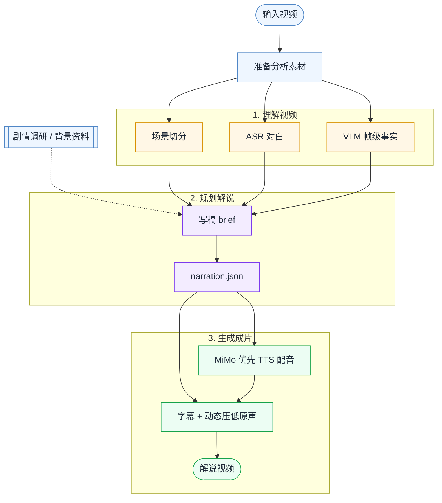

# video-recap

中文说明 · [English](README.md)

> 一个 Claude Code skill：把输入视频制作成中文解说 / recap 视频。结合剧情调研、ASR+VLM 画面理解、TTS 配音、字幕与动态混音。

[](LICENSE)


## 效果预览

https://github.com/user-attachments/assets/92698ec6-0d23-4f9f-8825-c3684ef57aff

## 这是什么？

`video-recap` 是一个 Claude Code skill，用来把已有视频制作成中文短视频解说 / recap。



## 为什么用它？

- **剧情调研先行**：把剧情梗概、人物关系、世界观和上下文纳入 brief，避免只看画面硬猜。
- **ASR + VLM 双通道理解**：对白转写补剧情线索，VLM 描述和帧级事实补动作、表情与场景信息。
- **写稿前先给时间预算**：`agent_narration_brief.md` 标出安静窗口、对白重叠、场景时长和字数预算。
- **保留原声质感**：解说出现时动态压低原声，尽量保留对白、环境声和原片节奏。
- **改稿后低成本续跑**：直接编辑 `narration.json`，通常只重跑 TTS/组装，不必重新分析视频。
- **支持剪辑式解说**：`--edit-mode cut` 下用 `clip_plan.json` 选择原片片段，可把长视频剪成短解说。
- **MiMo 优先的 TTS 支持**：`--tts` 支持 `auto`、`edge-tts`、`mimo-tts`；默认 `auto` 在 MiMo key 已配置时优先选 MiMo TTS，否则才回退 `edge-tts`。
- **无 MiMo key 时仍可运行**：没有 MiMo 配置时使用 `edge-tts` 和 `zh-CN-YunxiNeural` 作为免 key 后备。

## 安装

### 1. 安装 Claude Code skill

直接告诉 Claude Code：

```text
安装这个 skill https://github.com/worldwonderer/video-recap
```

### 2. 安装运行依赖

```bash
brew install ffmpeg
pip3 install edge-tts
```

### 3. 配置 OpenAI 兼容 API

```bash
export OPENAI_API_KEY=your-key
export OPENAI_API_URL=https://your-api-url/v1
export OPENAI_MODEL=doubao-seed-2-0-lite-260428

# 如果代理或服务商对 VLM 并发敏感，建议串行：
export VLM_WORKERS=1
```

### 可选：Xiaomi MiMo

MiMo 可用于可选的场景分片视频理解和 MiMo TTS 配音。密钥只放环境变量，
不要写进仓库文件、日志或文档。

最简单的混合配置：OpenAI 兼容端点（如 Doubao）负责帧级 VLM，
同一个 MiMo key 同时负责视频分片理解和 TTS。

```bash
export OPENAI_API_KEY=your-doubao-or-vlm-key
export OPENAI_API_URL=https://your-vlm-api-url/v1
export OPENAI_MODEL=doubao-seed-2-0-lite-260428

export MIMO_API_KEY=your-mimo-key
export MIMO_MODEL=mimo-v2.5

# 按量付费 sk-* key 默认使用 https://api.xiaomimimo.com/v1。
# Token Plan tp-* key 默认使用中国集群：
#   https://token-plan-cn.xiaomimimo.com/v1
# 订阅在其他集群时可覆盖：
export MIMO_TOKEN_PLAN_CLUSTER=cn   # cn | sgp | ams
# 或直接指定完整 base URL：
# export MIMO_API_URL=https://token-plan-cn.xiaomimimo.com/v1
```

MiMo 视频理解只走场景分片：先用 ffmpeg `scdet` 找场景边界，再把每个本地分片裁成 MP4，
编码为 `data:video/mp4;base64,...` 的 `video_url` 发给 MiMo。Pipeline 始终分析这些
本地 scene chunks，不绕过分片流程。每个分片默认按 45 MB 安全上限控制（MiMo base64
上限 50 MB）；分片过大时降低 `MIMO_VIDEO_CHUNK_MAX_SECONDS` 或 `MIMO_VIDEO_FPS`。

高级拆分端点是可选的：默认 `MIMO_API_KEY` / `MIMO_API_URL` 同时用于 MiMo 视频理解和 MiMo TTS；
只有需要不同网关时才设置 `MIMO_VIDEO_API_URL` / `MIMO_TTS_API_URL`，不同凭证才额外设置
`MIMO_VIDEO_API_KEY` / `MIMO_TTS_API_KEY`。

## 快速开始

安装 skill 后，在 Claude Code 里说：

```text
用 video-recap 为 /path/to/video.mp4 生成中文解说视频。
优先使用 MiMo TTS；如果没有 MiMo key，再用 edge-tts。背景：<节目 / 电影 / 角色信息>。
```

Pipeline 会准备场景、ASR、VLM 分析素材，然后生成 `agent_narration_brief.md` 并暂停。Agent 读取 brief 后写 `narration.json`，CLI 再续跑 TTS 与视频组装。

如果你想手动启动前置分析：

```bash
python3 skills/video-recap/scripts/video_recap.py /path/to/video.mp4 \
  --context "节目名、角色名、剧情背景"
```

使用 Doubao 做帧级 VLM、MiMo 做分片视频理解和 TTS 的示例：

```bash
python3 skills/video-recap/scripts/video_recap.py /path/to/video.mp4 \
  --vlm-model doubao-seed-2-0-lite-260428 \
  --mimo-video-overview \
  --mimo-tts-voice 冰糖
```

命令会在 TTS 前暂停并输出 `work_dir`。读取 `work_dir/agent_narration_brief.md`，写入 `work_dir/narration.json` 后，再执行打印出的续跑命令。

写完 `narration.json` 后，可以先用 `--step script` 做 TTS 前预检；CLI 会写出 `work_dir/narration_lint.json`，列出时间错误和预警。

如果要做“长视频剪短”的剪辑式解说（目标时长是选片规划目标）：

```bash
python3 skills/video-recap/scripts/video_recap.py /path/to/video.mp4 \
  --edit-mode cut \
  --target-duration 10m
```

cut 模式下同时写 `work_dir/clip_plan.json` 和 `work_dir/narration.json`，时间戳都用原视频时间。CLI 会生成 `edited_source.mp4`，把解说映射到 `narration_mapped.json`，再继续 TTS/组装。

如果要把解说字幕直接压制进最终视频，在续跑/组装时加 `--burn-subtitles`：

```bash
python3 skills/video-recap/scripts/video_recap.py /path/to/video.mp4 \
  --resume work_dir \
  --burn-subtitles
```

CLI 会根据最终 `narration.json` 和 TTS 实际放置时间导出 `subtitles.srt`；压制时会额外生成内部使用的 `subtitles.ass`，使用底部居中的可读样式。压制会对视频重编码，当前 `ffmpeg` 需要带 `subtitles`/libass 滤镜。

### Doctor 自检

```bash
python3 skills/video-recap/scripts/video_recap.py --doctor
```

如果还想测试后备 `edge-tts` 能否真实合成一小段音频，加 `--doctor-tts-smoke`。doctor 也会检查 ffmpeg 字幕滤镜、ASR 路径和模型目录、规范化后的 API 配置，以及默认 TTS 设置。

## 输出文件

常见输出：

- `recap_<video>.mp4`：最终解说视频
- `work_dir/subtitles.srt`：根据最终 TTS 放置时间生成的解说字幕
- `work_dir/subtitles.ass`：使用 `--burn-subtitles` 时用于压制的解说字幕文件
- `work_dir/agent_narration_brief.md`：给 Agent 写解说词用的场景与时长 brief
- `work_dir/narration.json`：解说词稿
- `work_dir/narration_lint.json`：`--step script` 或续跑验证时生成的写稿时间预检结果
- `work_dir/clip_plan.json`：cut 模式下要保留的原片片段
- `work_dir/edited_source.mp4`：cut 模式下拼出的短视频源
- `work_dir/narration_mapped.json`：从原视频时间映射到短视频时间的解说稿
- `work_dir/vlm_analysis.json`：场景级视觉分析
- `work_dir/mimo_video_overview.json`：可选的 MiMo 场景分片视频理解结果
- `work_dir/asr_result.json`：可用时的 ASR 转写结果；用于写解说参考
- `work_dir/tts_segments/`：分段 TTS 音频

## 参考文档

- [Skill 说明](skills/video-recap/SKILL.md)
- [Agent 模式工作流](skills/video-recap/references/agent-mode-workflow.md)
- [参数参考](skills/video-recap/references/parameters.md)
- [Prompt 模板](skills/video-recap/references/prompt-templates.md)
- [断点续跑与局部重跑](skills/video-recap/references/pipeline-resume.md)
- [数据结构](skills/video-recap/references/data-schema.md)

## 致谢

- [linux.do](https://linux.do)
- [qwen3-asr-rs](https://github.com/alan890104/qwen3-asr-rs)

## License / 许可证

MIT — see [LICENSE](LICENSE)。
